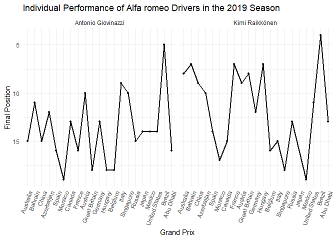
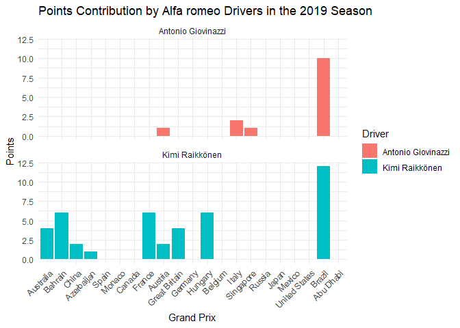
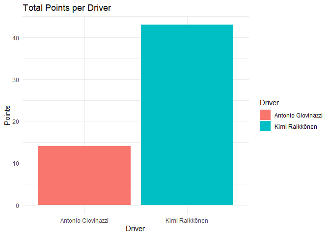
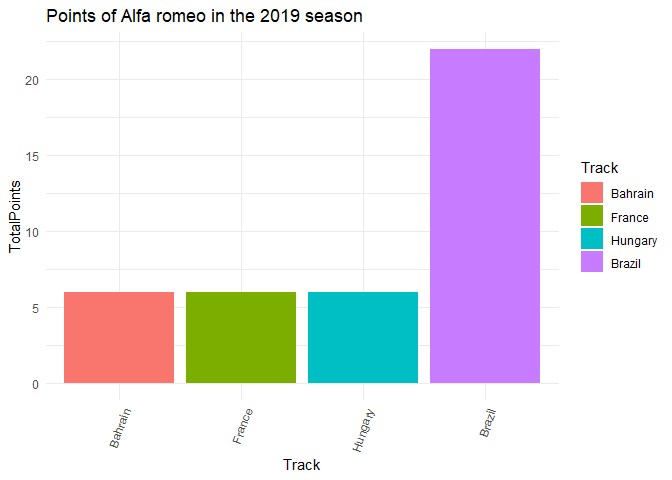
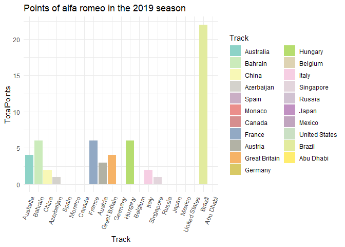
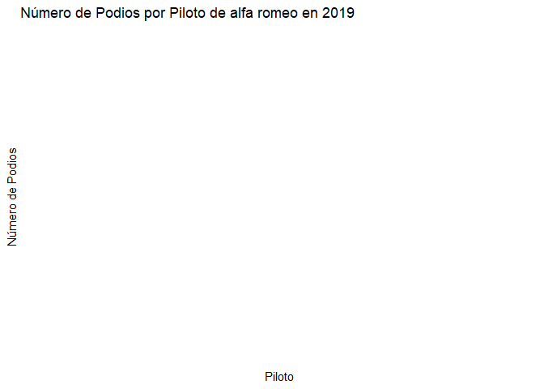

alfa romeo 2019
================
Moises Carrillo
2024-08-17

## Introduction

This report analyzes the performance of the Alfa romeo team in the 2019
Formula 1 season. We examine aspects such as final positions, points
earned, poles, victories, tracks and fastest laps, as well as the
pole-to-victory conversion rate.

# Data loading and preparation

In this part we load the data and we do some cleaning of the database

``` r
f1_2019_results <- read.csv('C:/Users/moise/Analysis_project/formula1_2019season_raceResults.csv')

alfa_romeo_2019 <- f1_2019_results %>%
  filter(Team == "Alfa Romeo Racing Ferrari", ignore.case = TRUE) %>% 
  select(Driver, Position, Points, Track, Starting.Grid, Fastest.Lap)

str(alfa_romeo_2019$Position)
```

    ##  chr [1:41] "8" "15" "7" "11" "9" "15" "10" "12" "14" "16" "17" "19" "13" ...

``` r
alfa_romeo_2019$Position <- as.numeric(alfa_romeo_2019$Position)
```

    ## Warning: NAs introduced by coercion

``` r
alfa_romeo_2019$Track <- factor(alfa_romeo_2019$Track, levels = unique(f1_2019_results$Track))
alfa_romeo_2019$Position[20] <- 18
alfa_romeo_2019$Position[30] <- 18
alfa_romeo_2019$Position[35] <- 19
alfa_romeo_2019
```

    ##                Driver Position Points         Track Starting.Grid Fastest.Lap
    ## 1      Kimi Raikkönen        8      4     Australia             9          No
    ## 2  Antonio Giovinazzi       15      0     Australia            14          No
    ## 3      Kimi Raikkönen        7      6       Bahrain             8          No
    ## 4  Antonio Giovinazzi       11      0       Bahrain            16          No
    ## 5      Kimi Raikkönen        9      2         China            13          No
    ## 6  Antonio Giovinazzi       15      0         China            19          No
    ## 7      Kimi Raikkönen       10      1    Azerbaijan            19          No
    ## 8  Antonio Giovinazzi       12      0    Azerbaijan            17          No
    ## 9      Kimi Raikkönen       14      0         Spain            14          No
    ## 10 Antonio Giovinazzi       16      0         Spain            18          No
    ## 11     Kimi Raikkönen       17      0        Monaco            14          No
    ## 12 Antonio Giovinazzi       19      0        Monaco            18          No
    ## 13 Antonio Giovinazzi       13      0        Canada            12          No
    ## 14     Kimi Raikkönen       15      0        Canada            16          No
    ## 15     Kimi Raikkönen        7      6        France            12          No
    ## 16 Antonio Giovinazzi       16      0        France            10          No
    ## 17     Kimi Raikkönen        9      2       Austria             6          No
    ## 18 Antonio Giovinazzi       10      1       Austria             7          No
    ## 19     Kimi Raikkönen        8      4 Great Britain            12          No
    ## 20 Antonio Giovinazzi       18      0 Great Britain            11          No
    ## 21     Kimi Raikkönen       12      0       Germany             5          No
    ## 22 Antonio Giovinazzi       13      0       Germany            11          No
    ## 23     Kimi Raikkönen        7      6       Hungary            10          No
    ## 24 Antonio Giovinazzi       18      0       Hungary            17          No
    ## 25     Kimi Raikkönen       16      0       Belgium             6          No
    ## 26 Antonio Giovinazzi       18      0       Belgium            18          No
    ## 27 Antonio Giovinazzi        9      2         Italy            10          No
    ## 28     Kimi Raikkönen       15      0         Italy            20          No
    ## 29 Antonio Giovinazzi       10      1     Singapore            10          No
    ## 30     Kimi Raikkönen       18      0     Singapore            12          No
    ## 31     Kimi Raikkönen       13      0        Russia            15          No
    ## 32 Antonio Giovinazzi       15      0        Russia            12          No
    ## 33 Antonio Giovinazzi       14      0         Japan            11          No
    ## 34 Antonio Giovinazzi       14      0        Mexico            15          No
    ## 35     Kimi Raikkönen       19      0        Mexico            14          No
    ## 36     Kimi Raikkönen       11      0 United States            17          No
    ## 37 Antonio Giovinazzi       14      0 United States            16          No
    ## 38     Kimi Raikkönen        4     12        Brazil             8          No
    ## 39 Antonio Giovinazzi        5     10        Brazil            12          No
    ## 40     Kimi Raikkönen       13      0     Abu Dhabi            17          No
    ## 41 Antonio Giovinazzi       16      0     Abu Dhabi            16          No

### Individual driver performance

We analyzed the individual performance of each driver trough the entire
season by visualize their finish position in each race of the 2019
season.

``` r
ggplot(alfa_romeo_2019, aes(x = Track, y = Position, group = Driver)) +
  geom_line(linewidth = 1) +
  geom_point(size = 1) +
  scale_y_reverse() +
  labs(title = "Individual Performance of Alfa romeo Drivers in the 2019 Season",
       x = "Grand Prix",
       y = "Final Position") +
  theme_minimal() +
  theme(axis.text.x = element_text(angle = 70, hjust = 1)) +
  facet_wrap(~ Driver)
```

<!-- -->

We see that Kimi was quite more consistent in get better results than
his team mate.

### Points contribution

We analyzed the contribution in points of each driver

``` r
ggplot(alfa_romeo_2019, aes(x = Track, y = Points, fill = Driver)) +
  geom_bar(stat = "identity") +
  labs(title = "Points Contribution by Alfa romeo Drivers in the 2019 Season",
       x = "Grand Prix",
       y = "Points") +
  theme_minimal() +
  theme(axis.text.x = element_text(angle = 45, hjust = 1)) +
  facet_wrap(~ Driver, ncol = 1)
```

<!-- -->

Kimi Raikonenn get into the points more times than his team mate.

## Total points analysis

### Total points by driver

We analyzed the total points that each driver did in the 2019 season

``` r
total_points <- alfa_romeo_2019 %>% 
  group_by(Driver) %>% 
  summarise(Totalpoints = sum(Points, na.rm = TRUE)) 

total_points
```

    ## # A tibble: 2 × 2
    ##   Driver             Totalpoints
    ##   <chr>                    <int>
    ## 1 Antonio Giovinazzi          14
    ## 2 Kimi Raikkönen              43

``` r
ggplot(total_points, aes(x = Driver, y = Totalpoints, fill = Driver)) +
  geom_bar(stat = 'identity') +
  labs(title = "Total Points per Driver", 
       x = "Driver",
       y = "Points") +
  theme_minimal()
```

<!-- -->

Kimi triplicates the points of his team mate

### Points of the team

Points of the team

``` r
alfa_romeo_points <- alfa_romeo_2019 %>%
  group_by(Track) %>%
  summarise(TotalPoints = sum(Points, na.rm = TRUE)) %>%
  ungroup()

alfa_romeo_points
```

    ## # A tibble: 21 × 2
    ##    Track         TotalPoints
    ##    <fct>               <int>
    ##  1 Australia               4
    ##  2 Bahrain                 6
    ##  3 China                   2
    ##  4 Azerbaijan              1
    ##  5 Spain                   0
    ##  6 Monaco                  0
    ##  7 Canada                  0
    ##  8 France                  6
    ##  9 Austria                 3
    ## 10 Great Britain           4
    ## # ℹ 11 more rows

### Track points

We analyzed which was the circuits were the team score more points

``` r
top_circuits <- alfa_romeo_points %>%
  top_n(3, wt = TotalPoints) %>%
  arrange(desc(TotalPoints))

top_circuits
```

    ## # A tibble: 4 × 2
    ##   Track   TotalPoints
    ##   <fct>         <int>
    ## 1 Brazil           22
    ## 2 Bahrain           6
    ## 3 France            6
    ## 4 Hungary           6

``` r
ggplot(top_circuits, aes(x = Track, y = TotalPoints, fill = Track))+
  geom_bar(stat = "identity")+
  labs(title = "Points of Alfa romeo in the 2019 season")+
  theme_minimal() +
  theme(axis.text.x = element_text(angle = 70, hjust = 1))
```

<!-- -->

We see that there were 4 best circuits where the team score the same
amount of points.

### Total pints per track

We analyzed how many points scored Alfa romeo per each circuit

``` r
ggplot(alfa_romeo_points, aes(x = Track, y = TotalPoints, fill = Track))+
  geom_bar(stat = "identity")+
  labs(title = "Points of alfa romeo in the 2019 season")+
  theme_minimal() +
  theme(axis.text.x = element_text(angle = 70, hjust = 1))+
  scale_fill_manual(values = colorRampPalette(brewer.pal(12, "Set3"))(21))
```

<!-- -->

### Total points of the season for the team

``` r
total_points_season <- alfa_romeo_2019 %>% 
  summarise(TotalPoints = sum(Points, na.rm = TRUE))

total_points_season
```

    ##   TotalPoints
    ## 1          57

At the end of the season, Alfa romeo scored 57 points and that give them
the eight place in the Constructors championship of the 2019 season of
Formula 1

## Analysis of poles and victories

### Number of poles per driver

We analyzed the number of poles that each driver did.

``` r
n_poles <- alfa_romeo_2019 %>% 
  filter(Starting.Grid == 1) %>%
  count(Driver, name = "NumPoles")

n_poles
```

    ## [1] Driver   NumPoles
    ## <0 rows> (or 0-length row.names)

None drivers made Poles

### Track poles

We analyzed in which circuits the drivers made pole position

``` r
alfa_romeo_2019$Track <- as.character(alfa_romeo_2019$Track)#Convert track into a vector

track_poles <- alfa_romeo_2019 %>% 
  filter(Starting.Grid == 1) %>% 
  select(Driver, Track)

track_poles
```

    ## [1] Driver Track 
    ## <0 rows> (or 0-length row.names)

### Number of victories per driver

We analyzed the number of victories that each driver did, and we
compared.

``` r
n_victories <- alfa_romeo_2019 %>% 
  filter(Position == 1) %>%
  count(Driver, name = "NumVictories")

n_victories
```

    ## [1] Driver       NumVictories
    ## <0 rows> (or 0-length row.names)

None drivers got victories

### Track victories

We analyzed in which circuits the drivers got a victories

``` r
n_victories <- alfa_romeo_2019 %>% 
  filter(Position == 1)%>%
  count(Driver, name = "NumVictories")

n_victories
```

    ## [1] Driver       NumVictories
    ## <0 rows> (or 0-length row.names)

### Pole to victory conversion rate

As each driver made pole and victory, we analyzed what was the
conversion rate that each driver made to convert a pole to victory

``` r
poles_victories <- alfa_romeo_2019 %>%
  group_by(Driver) %>% 
  filter(Starting.Grid == 1) %>%
  summarise(TotalPoles = n(),
            PolesConvertedToWins = sum(Position == 1)) %>%
  mutate(ConversionRate = (PolesConvertedToWins / TotalPoles) * 100)

poles_victories
```

    ## # A tibble: 0 × 4
    ## # ℹ 4 variables: Driver <chr>, TotalPoles <int>, PolesConvertedToWins <int>,
    ## #   ConversionRate <dbl>

As there are no poles and victories, there is no conversion.

### Poles and victory

This is for in which circuit the driver made pole and get the victory of
the same race

``` r
poles_and_victorie <- alfa_romeo_2019 %>% 
  filter(Starting.Grid == 1, Position == 1) %>% 
  select(Driver, Track)

poles_and_victorie
```

    ## [1] Driver Track 
    ## <0 rows> (or 0-length row.names)

## Analyze podiums and fastest laps

\#Podiums

We analyzed how many podiums got each driver

``` r
podiums_per_driver <- alfa_romeo_2019 %>%
  group_by(Driver) %>% 
  filter(Position %in% 1:3) %>%
  count(Driver, name = "NumPodiums")

podiums_per_driver
```

    ## # A tibble: 0 × 2
    ## # Groups:   Driver [0]
    ## # ℹ 2 variables: Driver <chr>, NumPodiums <int>

``` r
#Graphs of podiums
ggplot(podiums_per_driver, aes(x = Driver, y = NumPodiums, fill = Driver)) +
  geom_bar(stat = "identity") +
  labs(title = "Número de Podios por Piloto de alfa romeo en 2019",
       x = "Piloto",
       y = "Número de Podios") +
  theme_minimal()
```

<!-- -->

``` r
facet_wrap(~Driver)
```

    ## <ggproto object: Class FacetWrap, Facet, gg>
    ##     compute_layout: function
    ##     draw_back: function
    ##     draw_front: function
    ##     draw_labels: function
    ##     draw_panels: function
    ##     finish_data: function
    ##     init_scales: function
    ##     map_data: function
    ##     params: list
    ##     setup_data: function
    ##     setup_params: function
    ##     shrink: TRUE
    ##     train_scales: function
    ##     vars: function
    ##     super:  <ggproto object: Class FacetWrap, Facet, gg>

None drivers got a podium

### Fastests laps

We analyzed how many fastest laps got each driver.

``` r
fastest_laps_per_driver <- alfa_romeo_2019 %>%
  group_by(Driver) %>% 
  filter(Fastest.Lap == "Yes") %>%
  count(Driver, name = "NumFastestLaps")

fastest_laps_per_driver
```

    ## # A tibble: 0 × 2
    ## # Groups:   Driver [0]
    ## # ℹ 2 variables: Driver <chr>, NumFastestLaps <int>

No fastest laps

# Conclusion

This analysis showcases that Kimi Raikonenn was more consistent in get
into the points than his team mate, Antonio Giovinazzi.
