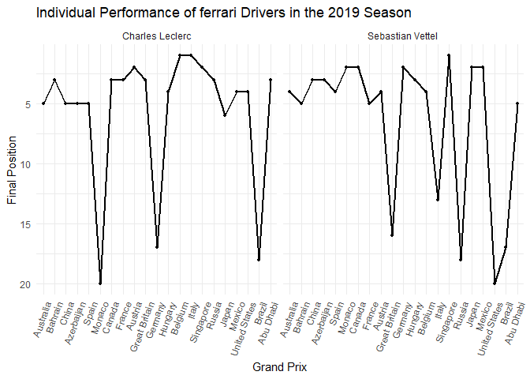
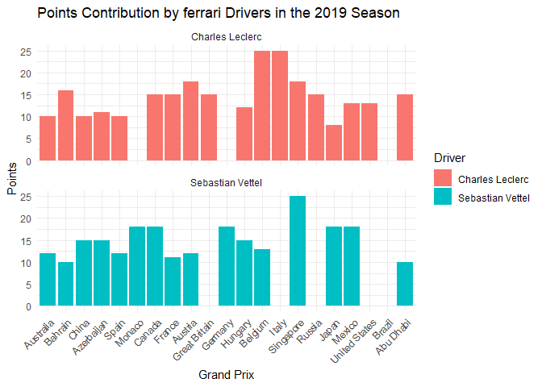
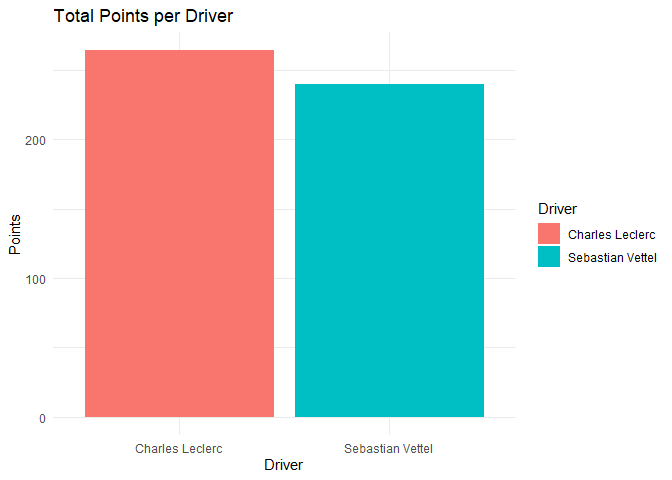
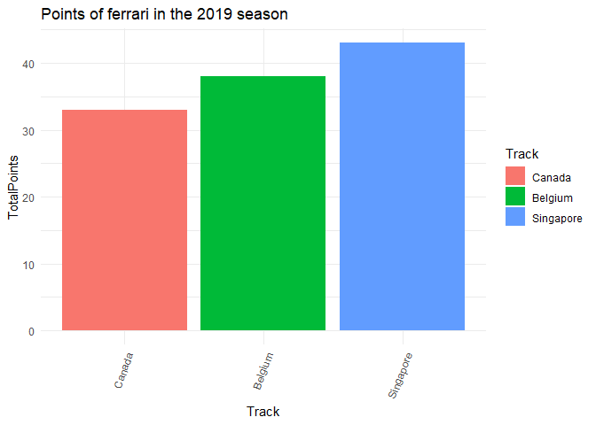
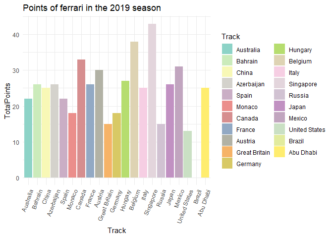
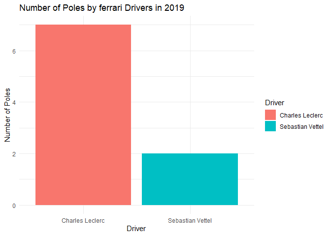
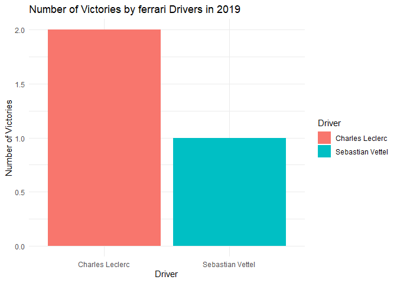
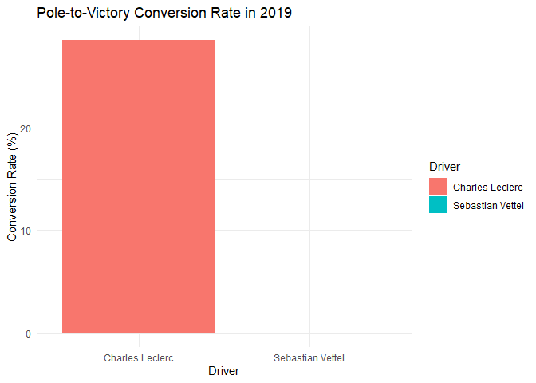
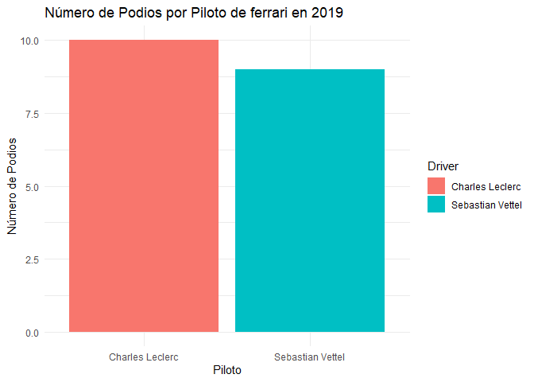
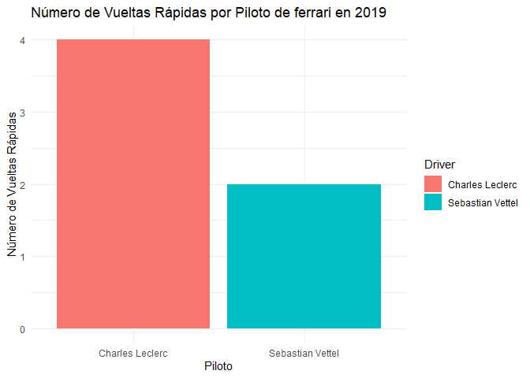

ferrari 2019
================
Moises Carrillo
2024-08-17

## Introduction

This report analyzes the performance of the ferrari team in the 2019
Formula 1 season. We examine aspects such as final positions, points
earned, poles, victories, tracks and fastest laps, as well as the
pole-to-victory conversion rate.

# Data loading and preparation

In this part we load the data and we do some cleaning of the database

``` r
f1_2019_results <- read.csv('C:/Users/moise/Analysis_project/formula1_2019season_raceResults.csv')

ferrari_2019 <- f1_2019_results %>%
  filter(Team == "Ferrari", ignore.case = TRUE) %>% 
  select(Driver, Position, Points, Track, Starting.Grid, Fastest.Lap)

str(ferrari_2019$Position)
```

    ##  chr [1:43] "4" "5" "3" "5" "3" "5" "3" "5" "4" "5" "2" "NC" "2" "3" "3" ...

``` r
ferrari_2019$Position <- as.numeric(ferrari_2019$Position)
```

    ## Warning: NAs introduced by coercion

``` r
ferrari_2019$Track <- factor(ferrari_2019$Track, levels = unique(f1_2019_results$Track))
ferrari_2019$Position[12] <- 20
ferrari_2019$Position[22] <- 17
ferrari_2019$Position[33] <- 18
ferrari_2019$Position[39] <- 20
ferrari_2019 <- ferrari_2019[-29,]
ferrari_2019 <- ferrari_2019
row.names(ferrari_2019) <- NULL
ferrari_2019
```

    ##              Driver Position Points         Track Starting.Grid Fastest.Lap
    ## 1  Sebastian Vettel        4     12     Australia             3          No
    ## 2   Charles Leclerc        5     10     Australia             5          No
    ## 3   Charles Leclerc        3     16       Bahrain             1         Yes
    ## 4  Sebastian Vettel        5     10       Bahrain             2          No
    ## 5  Sebastian Vettel        3     15         China             3          No
    ## 6   Charles Leclerc        5     10         China             4          No
    ## 7  Sebastian Vettel        3     15    Azerbaijan             3          No
    ## 8   Charles Leclerc        5     11    Azerbaijan             8         Yes
    ## 9  Sebastian Vettel        4     12         Spain             3          No
    ## 10  Charles Leclerc        5     10         Spain             5          No
    ## 11 Sebastian Vettel        2     18        Monaco             4          No
    ## 12  Charles Leclerc       20      0        Monaco            15          No
    ## 13 Sebastian Vettel        2     18        Canada             1          No
    ## 14  Charles Leclerc        3     15        Canada             3          No
    ## 15  Charles Leclerc        3     15        France             3          No
    ## 16 Sebastian Vettel        5     11        France             7         Yes
    ## 17  Charles Leclerc        2     18       Austria             1          No
    ## 18 Sebastian Vettel        4     12       Austria             9          No
    ## 19  Charles Leclerc        3     15 Great Britain             3          No
    ## 20 Sebastian Vettel       16      0 Great Britain             6          No
    ## 21 Sebastian Vettel        2     18       Germany            20          No
    ## 22  Charles Leclerc       17      0       Germany            10          No
    ## 23 Sebastian Vettel        3     15       Hungary             5          No
    ## 24  Charles Leclerc        4     12       Hungary             4          No
    ## 25  Charles Leclerc        1     25       Belgium             1          No
    ## 26 Sebastian Vettel        4     13       Belgium             2         Yes
    ## 27  Charles Leclerc        1     25         Italy             1          No
    ## 28 Sebastian Vettel       13      0         Italy             4          No
    ## 29 Sebastian Vettel        1     25     Singapore             3          No
    ## 30  Charles Leclerc        2     18     Singapore             1          No
    ## 31  Charles Leclerc        3     15        Russia             1          No
    ## 32 Sebastian Vettel       18      0        Russia             3          No
    ## 33 Sebastian Vettel        2     18         Japan             1          No
    ## 34  Charles Leclerc        6      8         Japan             2          No
    ## 35 Sebastian Vettel        2     18        Mexico             2          No
    ## 36  Charles Leclerc        4     13        Mexico             1         Yes
    ## 37  Charles Leclerc        4     13 United States             4         Yes
    ## 38 Sebastian Vettel       20      0 United States             2          No
    ## 39 Sebastian Vettel       17      0        Brazil             2          No
    ## 40  Charles Leclerc       18      0        Brazil            14          No
    ## 41  Charles Leclerc        3     15     Abu Dhabi             3          No
    ## 42 Sebastian Vettel        5     10     Abu Dhabi             4          No

### Individual driver performance

We analyzed the individual performance of each driver trough the entire
season by visualize their finish position in each race of the 2019
season.

``` r
ggplot(ferrari_2019, aes(x = Track, y = Position, group = Driver)) +
  geom_line(linewidth = 1) +
  geom_point(size = 1) +
  scale_y_reverse() +
  labs(title = "Individual Performance of ferrari Drivers in the 2019 Season",
       x = "Grand Prix",
       y = "Final Position") +
  theme_minimal() +
  theme(axis.text.x = element_text(angle = 70, hjust = 1)) +
  facet_wrap(~ Driver)
```

<!-- -->

We see that bout ferrari drivers were quite inconsistent trough the
season.

### Points contribution

We analyzed the contribution in points of each driver

``` r
ggplot(ferrari_2019, aes(x = Track, y = Points, fill = Driver)) +
  geom_bar(stat = "identity") +
  labs(title = "Points Contribution by ferrari Drivers in the 2019 Season",
       x = "Grand Prix",
       y = "Points") +
  theme_minimal() +
  theme(axis.text.x = element_text(angle = 45, hjust = 1)) +
  facet_wrap(~ Driver, ncol = 1)
```

<!-- -->

Even the inconsisten, bout ferrari drivers were able to get victories.

## Total points analysis

### Total points by driver

We analyzed the total points that each driver did in the 2019 season

``` r
total_points <- ferrari_2019 %>% 
  group_by(Driver) %>% 
  summarise(Totalpoints = sum(Points, na.rm = TRUE)) 

total_points
```

    ## # A tibble: 2 × 2
    ##   Driver           Totalpoints
    ##   <chr>                  <int>
    ## 1 Charles Leclerc          264
    ## 2 Sebastian Vettel         240

``` r
ggplot(total_points, aes(x = Driver, y = Totalpoints, fill = Driver)) +
  geom_bar(stat = 'identity') +
  labs(title = "Total Points per Driver", 
       x = "Driver",
       y = "Points") +
  theme_minimal()
```

<!-- -->

In his first season with Ferrari Charles Leclerc beats Sebastian Vettel
who was a 4 world championship.

### Team points

``` r
ferrari_points <- ferrari_2019 %>%
  group_by(Track) %>%
  summarise(TotalPoints = sum(Points, na.rm = TRUE)) %>%
  ungroup()

ferrari_points
```

    ## # A tibble: 21 × 2
    ##    Track         TotalPoints
    ##    <fct>               <int>
    ##  1 Australia              22
    ##  2 Bahrain                26
    ##  3 China                  25
    ##  4 Azerbaijan             26
    ##  5 Spain                  22
    ##  6 Monaco                 18
    ##  7 Canada                 33
    ##  8 France                 26
    ##  9 Austria                30
    ## 10 Great Britain          15
    ## # ℹ 11 more rows

### Track points

We analyzed which was the circuits were the team score more points

``` r
top_circuits <- ferrari_points %>%
  top_n(3, wt = TotalPoints) %>%
  arrange(desc(TotalPoints))

top_circuits
```

    ## # A tibble: 3 × 2
    ##   Track     TotalPoints
    ##   <fct>           <int>
    ## 1 Singapore          43
    ## 2 Belgium            38
    ## 3 Canada             33

``` r
ggplot(top_circuits, aes(x = Track, y = TotalPoints, fill = Track))+
  geom_bar(stat = "identity")+
  labs(title = "Points of ferrari in the 2019 season")+
  theme_minimal() +
  theme(axis.text.x = element_text(angle = 70, hjust = 1))
```

<!-- -->

We see that there were 3 best circuits where the team score the same
amount of points.

### Total pints per track

We analyzed how many points scored Ferrari per each circuit

``` r
ggplot(ferrari_points, aes(x = Track, y = TotalPoints, fill = Track))+
  geom_bar(stat = "identity")+
  labs(title = "Points of ferrari in the 2019 season")+
  theme_minimal() +
  theme(axis.text.x = element_text(angle = 70, hjust = 1))+
  scale_fill_manual(values = colorRampPalette(brewer.pal(12, "Set3"))(21))
```

<!-- -->

### Total points of the season for the team

``` r
total_points_season <- ferrari_2019 %>% 
  summarise(TotalPoints = sum(Points, na.rm = TRUE))

total_points_season
```

    ##   TotalPoints
    ## 1         504

At the end of the season, Ferrari scored 504 points and that give them
the second place in the Constructors championship of the 2019 season of
Formula 1

## Analysis of poles and victories

### Number of poles per driver

We analyzed the number of poles that each driver did.

``` r
n_poles <- ferrari_2019 %>% 
  filter(Starting.Grid == 1) %>%
  count(Driver, name = "NumPoles")

n_poles
```

    ##             Driver NumPoles
    ## 1  Charles Leclerc        7
    ## 2 Sebastian Vettel        2

``` r
ggplot(n_poles, aes(x = Driver, y = NumPoles, fill = Driver)) +
  geom_bar(stat = "identity") +
  labs(title = "Number of Poles by ferrari Drivers in 2019",
       x = "Driver",
       y = "Number of Poles") +
  theme_minimal()
```

<!-- -->

We see that Charles Leclerc get more poles than Sebastian Vettel.

### Track poles

We analyzed in which circuits the drivers made pole position

``` r
ferrari_2019$Track <- as.character(ferrari_2019$Track)#Convert track into a vector

track_poles <- ferrari_2019 %>% 
  filter(Starting.Grid == 1) %>% 
  select(Driver, Track)

track_poles
```

    ##             Driver     Track
    ## 1  Charles Leclerc   Bahrain
    ## 2 Sebastian Vettel    Canada
    ## 3  Charles Leclerc   Austria
    ## 4  Charles Leclerc   Belgium
    ## 5  Charles Leclerc     Italy
    ## 6  Charles Leclerc Singapore
    ## 7  Charles Leclerc    Russia
    ## 8 Sebastian Vettel     Japan
    ## 9  Charles Leclerc    Mexico

### Number of victories per driver

We analyzed the number of victories that each driver did, and we
compared.

``` r
n_victories <- ferrari_2019 %>% 
  filter(Position == 1) %>%
  count(Driver, name = "NumVictories")

n_victories
```

    ##             Driver NumVictories
    ## 1  Charles Leclerc            2
    ## 2 Sebastian Vettel            1

``` r
ggplot(n_victories, aes(x = Driver, y=NumVictories, fill = Driver))+
  geom_bar(stat="identity")+
  labs(title = "Number of Victories by ferrari Drivers in 2019",
       x = "Driver",
       y = "Number of Victories")+
  theme_minimal()
```

<!-- -->

Leclerc score 1 more victory than Sebastian Vettel

### Track victories

We analyzed in which circuits the drivers got a victories

``` r
n_victories <- ferrari_2019 %>% 
  filter(Position == 1)%>%
  count(Driver, name = "NumVictories")

n_victories
```

    ##             Driver NumVictories
    ## 1  Charles Leclerc            2
    ## 2 Sebastian Vettel            1

### Pole to victory conversion rate

As each driver made pole and victory, we analyzed what was the
conversion rate that each driver made to convert a pole to victory

``` r
poles_victories <- ferrari_2019 %>%
  group_by(Driver) %>% 
  filter(Starting.Grid == 1) %>%
  summarise(TotalPoles = n(),
            PolesConvertedToWins = sum(Position == 1)) %>%
  mutate(ConversionRate = (PolesConvertedToWins / TotalPoles) * 100)

poles_victories
```

    ## # A tibble: 2 × 4
    ##   Driver           TotalPoles PolesConvertedToWins ConversionRate
    ##   <chr>                 <int>                <int>          <dbl>
    ## 1 Charles Leclerc           7                    2           28.6
    ## 2 Sebastian Vettel          2                    0            0

``` r
ggplot(poles_victories, aes(x = Driver, y = ConversionRate, fill = Driver)) +
  geom_bar(stat = "identity") +
  labs(title = "Pole-to-Victory Conversion Rate in 2019",
       x = "Driver",
       y = "Conversion Rate (%)") +
  theme_minimal()
```

<!-- -->

Even score more poles, Leclerc was only able to transform 7 Poles
position to 2 victories trough the season.

### Poles and victory

This is for in which circuit the driver made pole and get the victory of
the same race

``` r
poles_and_victorie <- ferrari_2019 %>% 
  filter(Starting.Grid == 1, Position == 1) %>% 
  select(Driver, Track)

poles_and_victorie
```

    ##            Driver   Track
    ## 1 Charles Leclerc Belgium
    ## 2 Charles Leclerc   Italy

## Analyze podiums and fastest laps

\#Podiums

We analyzed how many podiums got each driver

``` r
podiums_per_driver <- ferrari_2019 %>%
  group_by(Driver) %>% 
  filter(Position %in% 1:3) %>%
  count(Driver, name = "NumPodiums")

podiums_per_driver
```

    ## # A tibble: 2 × 2
    ## # Groups:   Driver [2]
    ##   Driver           NumPodiums
    ##   <chr>                 <int>
    ## 1 Charles Leclerc          10
    ## 2 Sebastian Vettel          9

``` r
#Graphs of podiums
ggplot(podiums_per_driver, aes(x = Driver, y = NumPodiums, fill = Driver)) +
  geom_bar(stat = "identity") +
  labs(title = "Número de Podios por Piloto de ferrari en 2019",
       x = "Piloto",
       y = "Número de Podios") +
  theme_minimal()
```

<!-- -->

``` r
facet_wrap(~Driver)
```

    ## <ggproto object: Class FacetWrap, Facet, gg>
    ##     compute_layout: function
    ##     draw_back: function
    ##     draw_front: function
    ##     draw_labels: function
    ##     draw_panels: function
    ##     finish_data: function
    ##     init_scales: function
    ##     map_data: function
    ##     params: list
    ##     setup_data: function
    ##     setup_params: function
    ##     shrink: TRUE
    ##     train_scales: function
    ##     vars: function
    ##     super:  <ggproto object: Class FacetWrap, Facet, gg>

We see that for the minimum Leclerc beats Vettel in the podiums.

### Fastests laps

We analyzed how many fastests laps got each driver.

``` r
fastest_laps_per_driver <- ferrari_2019 %>%
  group_by(Driver) %>% 
  filter(Fastest.Lap == "Yes") %>%
  count(Driver, name = "NumFastestLaps")

fastest_laps_per_driver
```

    ## # A tibble: 2 × 2
    ## # Groups:   Driver [2]
    ##   Driver           NumFastestLaps
    ##   <chr>                     <int>
    ## 1 Charles Leclerc               4
    ## 2 Sebastian Vettel              2

``` r
#graphs of fastest laps
ggplot(fastest_laps_per_driver, aes(x = Driver, y = NumFastestLaps, fill = Driver)) +
  geom_bar(stat = "identity") +
  labs(title = "Número de Vueltas Rápidas por Piloto de ferrari en 2019",
       x = "Piloto",
       y = "Número de Vueltas Rápidas") +
  theme_minimal()
```

<!-- -->

``` r
facet_wrap(~Driver)
```

    ## <ggproto object: Class FacetWrap, Facet, gg>
    ##     compute_layout: function
    ##     draw_back: function
    ##     draw_front: function
    ##     draw_labels: function
    ##     draw_panels: function
    ##     finish_data: function
    ##     init_scales: function
    ##     map_data: function
    ##     params: list
    ##     setup_data: function
    ##     setup_params: function
    ##     shrink: TRUE
    ##     train_scales: function
    ##     vars: function
    ##     super:  <ggproto object: Class FacetWrap, Facet, gg>

We see that Charles Leclerc made more fastests laps than Sebastian
Vettel

# Conclusion

This analysis showcases that bout drivers had quite the same
consistent,Leclerc beats Vettel by quite few points to different others
teams.
