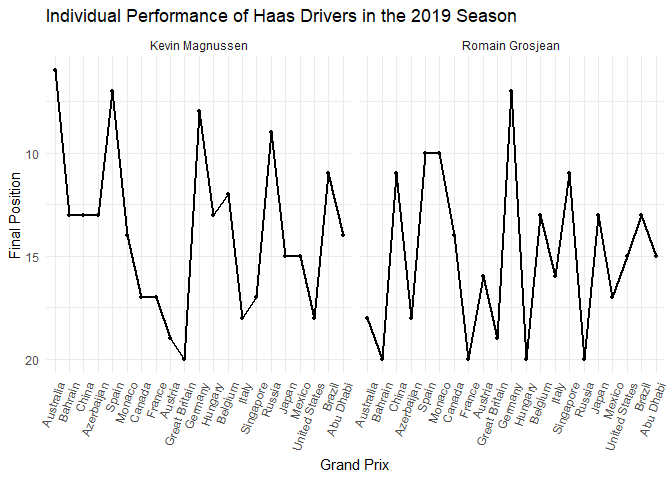
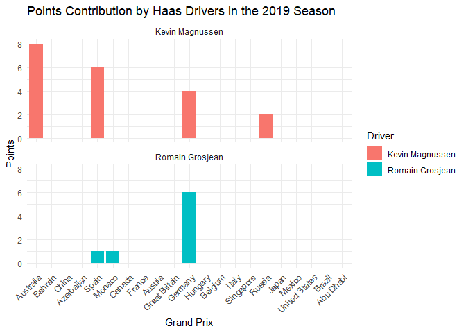
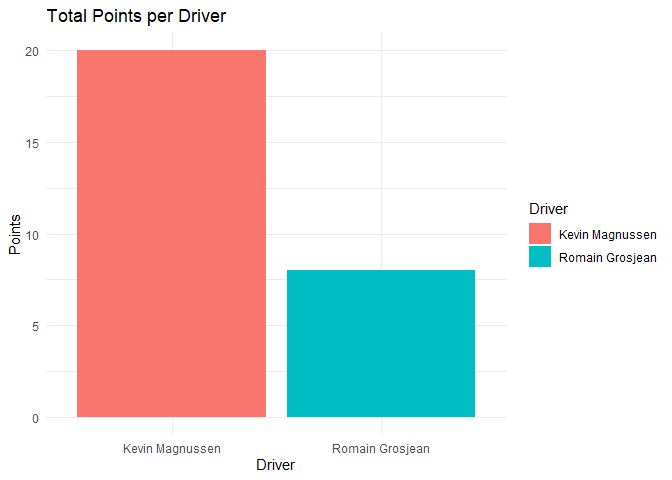
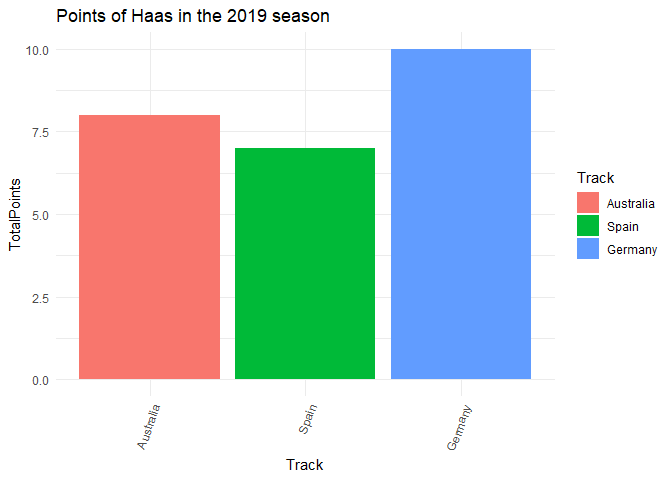
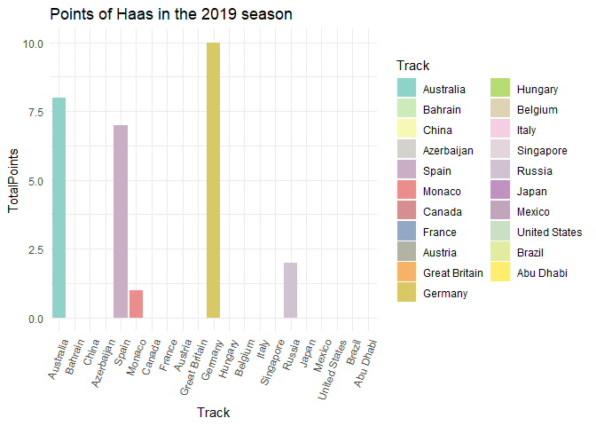
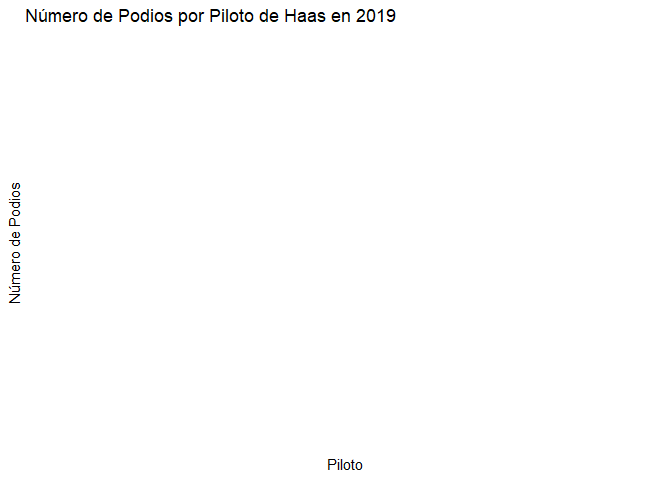

Haas 2019
================
Moises Carrillo
2024-08-17

## Introduction

This report analyzes the performance of the Haas team in the 2019
Formula 1 season. We examine aspects such as final positions, points
earned, poles, victories, tracks and fastest laps, as well as the
pole-to-victory conversion rate.

# Data loading and preparation

In this part we load the data and we do some cleaning of the database

``` r
f1_2019_results <- read.csv('C:/Users/moise/Analysis_project/formula1_2019season_raceResults.csv')

haas_2019 <- f1_2019_results %>%
  filter(Team == "Haas Ferrari", ignore.case = TRUE) %>% 
  select(Driver, Position, Points, Track, Starting.Grid, Fastest.Lap)

str(haas_2019$Position)
```

    ##  chr [1:43] "6" "NC" "13" "NC" "11" "13" "13" "NC" "7" "10" "10" "14" "14" ...

``` r
haas_2019$Position <- as.numeric(haas_2019$Position)
```

    ## Warning: NAs introduced by coercion

``` r
haas_2019$Track <- factor(haas_2019$Track, levels = unique(f1_2019_results$Track))
haas_2019$Position[2] <- 18
haas_2019$Position[4] <- 20
haas_2019$Position[8] <- 18
haas_2019$Position[16] <- 20
haas_2019$Position[19] <- 19
haas_2019$Position[20] <- 20
haas_2019$Position[24] <- 20
haas_2019$Position[28] <- 18
haas_2019$Position[32] <- 20
haas_2019 <- haas_2019[-33,]
haas_2019 <- haas_2019
row.names(haas_2019) <- NULL
haas_2019
```

    ##             Driver Position Points         Track Starting.Grid Fastest.Lap
    ## 1  Kevin Magnussen        6      8     Australia             7          No
    ## 2  Romain Grosjean       18      0     Australia             6          No
    ## 3  Kevin Magnussen       13      0       Bahrain             6          No
    ## 4  Romain Grosjean       20      0       Bahrain            11          No
    ## 5  Romain Grosjean       11      0         China            10          No
    ## 6  Kevin Magnussen       13      0         China             9          No
    ## 7  Kevin Magnussen       13      0    Azerbaijan            12          No
    ## 8  Romain Grosjean       18      0    Azerbaijan            14          No
    ## 9  Kevin Magnussen        7      6         Spain             8          No
    ## 10 Romain Grosjean       10      1         Spain             7          No
    ## 11 Romain Grosjean       10      1        Monaco            13          No
    ## 12 Kevin Magnussen       14      0        Monaco             5          No
    ## 13 Romain Grosjean       14      0        Canada            14          No
    ## 14 Kevin Magnussen       17      0        Canada            20          No
    ## 15 Kevin Magnussen       17      0        France            15          No
    ## 16 Romain Grosjean       20      0        France            16          No
    ## 17 Romain Grosjean       16      0       Austria            11          No
    ## 18 Kevin Magnussen       19      0       Austria            10          No
    ## 19 Romain Grosjean       19      0 Great Britain            14          No
    ## 20 Kevin Magnussen       20      0 Great Britain            16          No
    ## 21 Romain Grosjean        7      6       Germany             6          No
    ## 22 Kevin Magnussen        8      4       Germany            12          No
    ## 23 Kevin Magnussen       13      0       Hungary            14          No
    ## 24 Romain Grosjean       20      0       Hungary             9          No
    ## 25 Kevin Magnussen       12      0       Belgium             8          No
    ## 26 Romain Grosjean       13      0       Belgium             9          No
    ## 27 Romain Grosjean       16      0         Italy            13          No
    ## 28 Kevin Magnussen       18      0         Italy            11          No
    ## 29 Romain Grosjean       11      0     Singapore            17          No
    ## 30 Kevin Magnussen       17      0     Singapore            13         Yes
    ## 31 Kevin Magnussen        9      2        Russia            13          No
    ## 32 Romain Grosjean       20      0        Russia             8          No
    ## 33 Romain Grosjean       13      0         Japan            10          No
    ## 34 Kevin Magnussen       15      0         Japan            19          No
    ## 35 Kevin Magnussen       15      0        Mexico            17          No
    ## 36 Romain Grosjean       17      0        Mexico            18          No
    ## 37 Romain Grosjean       15      0 United States            15          No
    ## 38 Kevin Magnussen       18      0 United States            12          No
    ## 39 Kevin Magnussen       11      0        Brazil             9          No
    ## 40 Romain Grosjean       13      0        Brazil             7          No
    ## 41 Kevin Magnussen       14      0     Abu Dhabi            14          No
    ## 42 Romain Grosjean       15      0     Abu Dhabi            15          No

### Individual driver performance

We analyzed the individual performance of each driver trough the entire
season by visualize their finish position in each race of the 2019
season.

``` r
ggplot(haas_2019, aes(x = Track, y = Position, group = Driver)) +
  geom_line(linewidth = 1) +
  geom_point(size = 1) +
  scale_y_reverse() +
  labs(title = "Individual Performance of Haas Drivers in the 2019 Season",
       x = "Grand Prix",
       y = "Final Position") +
  theme_minimal() +
  theme(axis.text.x = element_text(angle = 70, hjust = 1)) +
  facet_wrap(~ Driver)
```

<!-- -->

We see that bout Haas drivers were very inconsistent trough the season.

### Points contribution

We analyzed the contribution in points of each driver

``` r
ggplot(haas_2019, aes(x = Track, y = Points, fill = Driver)) +
  geom_bar(stat = "identity") +
  labs(title = "Points Contribution by Haas Drivers in the 2019 Season",
       x = "Grand Prix",
       y = "Points") +
  theme_minimal() +
  theme(axis.text.x = element_text(angle = 45, hjust = 1)) +
  facet_wrap(~ Driver, ncol = 1)
```

<!-- -->

Both drivers scored a few points trough the season

## Total points analysis

### Total points by driver

We analyzed the total points that each driver did in the 2019 season

``` r
total_points <- haas_2019 %>% 
  group_by(Driver) %>% 
  summarise(Totalpoints = sum(Points, na.rm = TRUE)) 

total_points
```

    ## # A tibble: 2 × 2
    ##   Driver          Totalpoints
    ##   <chr>                 <int>
    ## 1 Kevin Magnussen          20
    ## 2 Romain Grosjean           8

``` r
ggplot(total_points, aes(x = Driver, y = Totalpoints, fill = Driver)) +
  geom_bar(stat = 'identity') +
  labs(title = "Total Points per Driver", 
       x = "Driver",
       y = "Points") +
  theme_minimal()
```

<!-- -->

Kevin magnussen score more points than his team mate.

### Points of the team

Points of the team

``` r
haas_points <- haas_2019 %>%
  group_by(Track) %>%
  summarise(TotalPoints = sum(Points, na.rm = TRUE)) %>%
  ungroup()

haas_points
```

    ## # A tibble: 21 × 2
    ##    Track         TotalPoints
    ##    <fct>               <int>
    ##  1 Australia               8
    ##  2 Bahrain                 0
    ##  3 China                   0
    ##  4 Azerbaijan              0
    ##  5 Spain                   7
    ##  6 Monaco                  1
    ##  7 Canada                  0
    ##  8 France                  0
    ##  9 Austria                 0
    ## 10 Great Britain           0
    ## # ℹ 11 more rows

### Track points

We analyzed which was the circuits were the team score more points

``` r
top_circuits <- haas_points %>%
  top_n(3, wt = TotalPoints) %>%
  arrange(desc(TotalPoints))

top_circuits
```

    ## # A tibble: 3 × 2
    ##   Track     TotalPoints
    ##   <fct>           <int>
    ## 1 Germany            10
    ## 2 Australia           8
    ## 3 Spain               7

``` r
ggplot(top_circuits, aes(x = Track, y = TotalPoints, fill = Track))+
  geom_bar(stat = "identity")+
  labs(title = "Points of Haas in the 2019 season")+
  theme_minimal() +
  theme(axis.text.x = element_text(angle = 70, hjust = 1))
```

<!-- -->

We see that there were 3 best circuits where the team score the same
amount of points.

### Total pints per track

We analyzed how many points scored Haas per each circuit

``` r
ggplot(haas_points, aes(x = Track, y = TotalPoints, fill = Track))+
  geom_bar(stat = "identity")+
  labs(title = "Points of Haas in the 2019 season")+
  theme_minimal() +
  theme(axis.text.x = element_text(angle = 70, hjust = 1))+
  scale_fill_manual(values = colorRampPalette(brewer.pal(12, "Set3"))(21))
```

<!-- -->

### Total points of the season for the team

``` r
total_points_season <- haas_2019 %>% 
  summarise(TotalPoints = sum(Points, na.rm = TRUE))

total_points_season
```

    ##   TotalPoints
    ## 1          28

At the end of the season, Haas scored 28 points and that give them the
nineth place in the Constructors championship of the 2019 season of
Formula 1

## Analysis of poles and victories

### Number of poles per driver

We analyzed the number of poles that each driver did.

``` r
n_poles <- haas_2019 %>% 
  filter(Starting.Grid == 1) %>%
  count(Driver, name = "NumPoles")

n_poles
```

    ## [1] Driver   NumPoles
    ## <0 rows> (or 0-length row.names)

None drivers made Poles

### Track poles

We analyzed in which circuits the drivers made pole position

``` r
haas_2019$Track <- as.character(haas_2019$Track)#Convert track into a vector

track_poles <- haas_2019 %>% 
  filter(Starting.Grid == 1) %>% 
  select(Driver, Track)

track_poles
```

    ## [1] Driver Track 
    ## <0 rows> (or 0-length row.names)

### Number of victories per driver

We analyzed the number of victories that each driver did, and we
compared.

``` r
n_victories <- haas_2019 %>% 
  filter(Position == 1) %>%
  count(Driver, name = "NumVictories")

n_victories
```

    ## [1] Driver       NumVictories
    ## <0 rows> (or 0-length row.names)

None drivers got victories

### Track victories

We analyzed in which circuits the drivers got a victories

``` r
n_victories <- haas_2019 %>% 
  filter(Position == 1)%>%
  count(Driver, name = "NumVictories")

n_victories
```

    ## [1] Driver       NumVictories
    ## <0 rows> (or 0-length row.names)

### Pole to victory conversion rate

As each driver made pole and victory, we analyzed what was the
conversion rate that each driver made to convert a pole to victory

``` r
poles_victories <- haas_2019 %>%
  group_by(Driver) %>% 
  filter(Starting.Grid == 1) %>%
  summarise(TotalPoles = n(),
            PolesConvertedToWins = sum(Position == 1)) %>%
  mutate(ConversionRate = (PolesConvertedToWins / TotalPoles) * 100)

poles_victories
```

    ## # A tibble: 0 × 4
    ## # ℹ 4 variables: Driver <chr>, TotalPoles <int>, PolesConvertedToWins <int>,
    ## #   ConversionRate <dbl>

As there are no poles and victories, there is no conversion.

### Poles and victory

This is for in which circuit the driver made pole and get the victory of
the same race

``` r
poles_and_victorie <- haas_2019 %>% 
  filter(Starting.Grid == 1, Position == 1) %>% 
  select(Driver, Track)

poles_and_victorie
```

    ## [1] Driver Track 
    ## <0 rows> (or 0-length row.names)

## Analyze podiums and fastest laps

\#Podiums

We analyzed how many podiums got each driver

``` r
podiums_per_driver <- haas_2019 %>%
  group_by(Driver) %>% 
  filter(Position %in% 1:3) %>%
  count(Driver, name = "NumPodiums")

podiums_per_driver
```

    ## # A tibble: 0 × 2
    ## # Groups:   Driver [0]
    ## # ℹ 2 variables: Driver <chr>, NumPodiums <int>

``` r
#Graphs of podiums
ggplot(podiums_per_driver, aes(x = Driver, y = NumPodiums, fill = Driver)) +
  geom_bar(stat = "identity") +
  labs(title = "Número de Podios por Piloto de Haas en 2019",
       x = "Piloto",
       y = "Número de Podios") +
  theme_minimal()
```

<!-- -->

``` r
facet_wrap(~Driver)
```

    ## <ggproto object: Class FacetWrap, Facet, gg>
    ##     compute_layout: function
    ##     draw_back: function
    ##     draw_front: function
    ##     draw_labels: function
    ##     draw_panels: function
    ##     finish_data: function
    ##     init_scales: function
    ##     map_data: function
    ##     params: list
    ##     setup_data: function
    ##     setup_params: function
    ##     shrink: TRUE
    ##     train_scales: function
    ##     vars: function
    ##     super:  <ggproto object: Class FacetWrap, Facet, gg>

None driver got a podium

### Fastests laps

We analyzed how many fastests laps got each driver.

``` r
fastest_laps_per_driver <- haas_2019 %>%
  group_by(Driver) %>% 
  filter(Fastest.Lap == "Yes") %>%
  count(Driver, name = "NumFastestLaps")

fastest_laps_per_driver
```

    ## # A tibble: 1 × 2
    ## # Groups:   Driver [1]
    ##   Driver          NumFastestLaps
    ##   <chr>                    <int>
    ## 1 Kevin Magnussen              1

No fastest laps

# Conclusion

This analysis showcases that bout drivers were very inconsistent in get
into the points trough the season, Kevin was a little more consistent
than his team mate, and at the end, beat his team mate.
