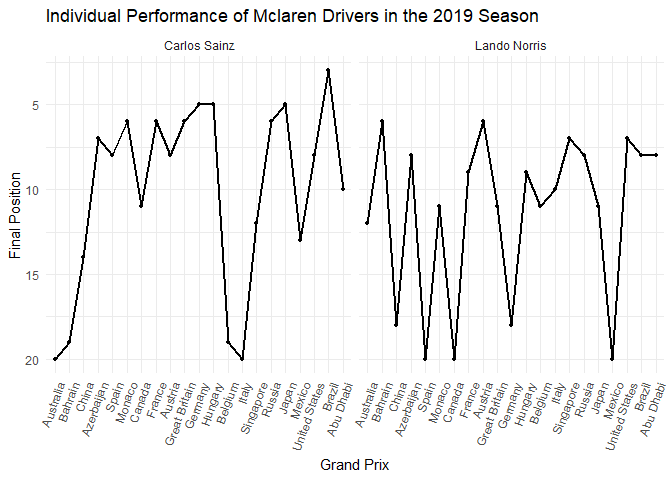
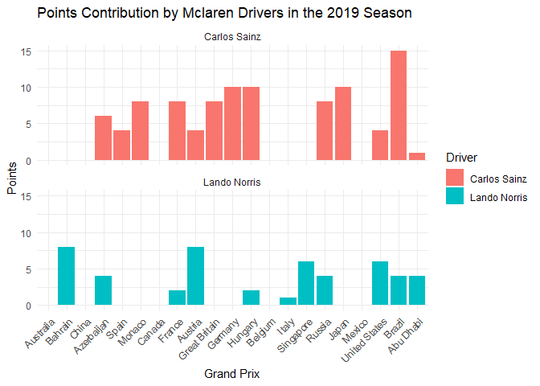
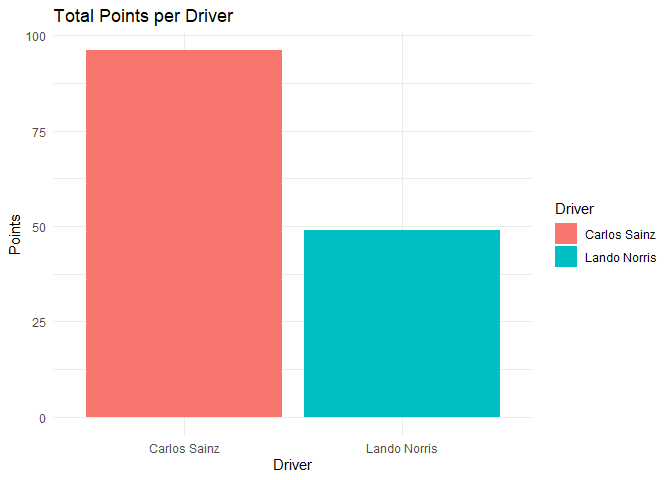
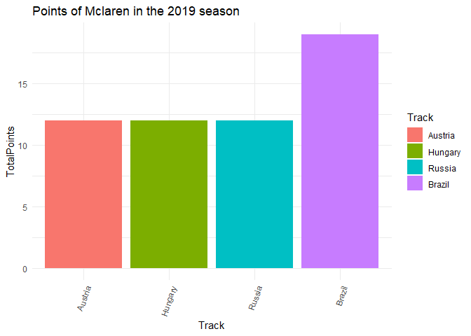
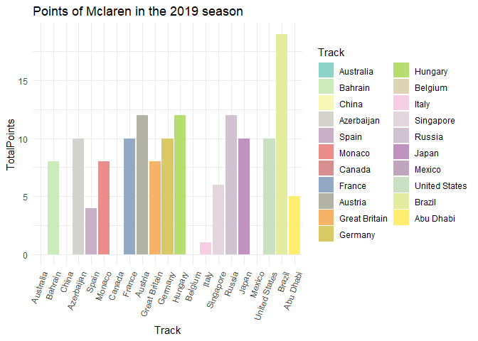
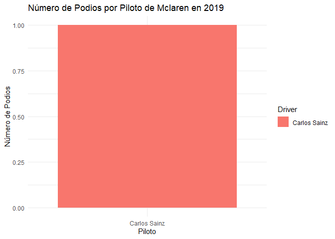

Mclaren 2019
================
Moises Carrillo
2024-08-17

## Introduction

This report analyzes the performance of the Mclaren team in the 2019
Formula 1 season. We examine aspects such as final positions, points
earned, poles, victories, tracks and fastest laps, as well as the
pole-to-victory conversion rate.

# Data loading and preparation

In this part we load the data and we do some cleaning of the database

``` r
f1_2019_results <- read.csv('C:/Users/moise/Analysis_project/formula1_2019season_raceResults.csv')

mclaren_2019 <- f1_2019_results %>%
  filter(Team == "McLaren Renault", ignore.case = TRUE) %>% 
  select(Driver, Position, Points, Track, Starting.Grid, Fastest.Lap)

str(mclaren_2019$Position)
```

    ##  chr [1:42] "12" "NC" "6" "19" "14" "18" "7" "8" "8" "NC" "6" "11" "11" ...

``` r
mclaren_2019$Position <- as.numeric(mclaren_2019$Position)
```

    ## Warning: NAs introduced by coercion

``` r
mclaren_2019$Track <- factor(mclaren_2019$Track, levels = unique(f1_2019_results$Track))
mclaren_2019$Position[2] <- 20
mclaren_2019$Position[10] <- 20
mclaren_2019$Position[14] <- 20
mclaren_2019$Position[22] <- 18
mclaren_2019$Position[26] <- 19
mclaren_2019$Position[28] <- 20
mclaren_2019$Position[36] <- 20
mclaren_2019
```

    ##          Driver Position Points         Track Starting.Grid Fastest.Lap
    ## 1  Lando Norris       12      0     Australia             8          No
    ## 2  Carlos Sainz       20      0     Australia            18          No
    ## 3  Lando Norris        6      8       Bahrain             9          No
    ## 4  Carlos Sainz       19      0       Bahrain             7          No
    ## 5  Carlos Sainz       14      0         China            14          No
    ## 6  Lando Norris       18      0         China            15          No
    ## 7  Carlos Sainz        7      6    Azerbaijan             9          No
    ## 8  Lando Norris        8      4    Azerbaijan             7          No
    ## 9  Carlos Sainz        8      4         Spain            12          No
    ## 10 Lando Norris       20      0         Spain            10          No
    ## 11 Carlos Sainz        6      8        Monaco             9          No
    ## 12 Lando Norris       11      0        Monaco            12          No
    ## 13 Carlos Sainz       11      0        Canada            11          No
    ## 14 Lando Norris       20      0        Canada             8          No
    ## 15 Carlos Sainz        6      8        France             6          No
    ## 16 Lando Norris        9      2        France             5          No
    ## 17 Lando Norris        6      8       Austria             5          No
    ## 18 Carlos Sainz        8      4       Austria            19          No
    ## 19 Carlos Sainz        6      8 Great Britain            13          No
    ## 20 Lando Norris       11      0 Great Britain             8          No
    ## 21 Carlos Sainz        5     10       Germany             7          No
    ## 22 Lando Norris       18      0       Germany            19          No
    ## 23 Carlos Sainz        5     10       Hungary             8          No
    ## 24 Lando Norris        9      2       Hungary             7          No
    ## 25 Lando Norris       11      0       Belgium            11          No
    ## 26 Carlos Sainz       19      0       Belgium            15          No
    ## 27 Lando Norris       10      1         Italy            16          No
    ## 28 Carlos Sainz       20      0         Italy             7          No
    ## 29 Lando Norris        7      6     Singapore             9          No
    ## 30 Carlos Sainz       12      0     Singapore             7          No
    ## 31 Carlos Sainz        6      8        Russia             5          No
    ## 32 Lando Norris        8      4        Russia             7          No
    ## 33 Carlos Sainz        5     10         Japan             7          No
    ## 34 Lando Norris       11      0         Japan             8          No
    ## 35 Carlos Sainz       13      0        Mexico             7          No
    ## 36 Lando Norris       20      0        Mexico             8          No
    ## 37 Lando Norris        7      6 United States             8          No
    ## 38 Carlos Sainz        8      4 United States             7          No
    ## 39 Carlos Sainz        3     15        Brazil            20          No
    ## 40 Lando Norris        8      4        Brazil            10          No
    ## 41 Lando Norris        8      4     Abu Dhabi             6          No
    ## 42 Carlos Sainz       10      1     Abu Dhabi             8          No

### Individual driver performance

We analyzed the individual performance of each driver trough the entire
season by visualize their finish position in each race of the 2019
season.

``` r
ggplot(mclaren_2019, aes(x = Track, y = Position, group = Driver)) +
  geom_line(linewidth = 1) +
  geom_point(size = 1) +
  scale_y_reverse() +
  labs(title = "Individual Performance of Mclaren Drivers in the 2019 Season",
       x = "Grand Prix",
       y = "Final Position") +
  theme_minimal() +
  theme(axis.text.x = element_text(angle = 70, hjust = 1)) +
  facet_wrap(~ Driver)
```

<!-- -->

We see that bout Mclaren drivers were quite inconsistent trough the
season.

### Points contribution

We analyzed the contribution in points of each driver

``` r
ggplot(mclaren_2019, aes(x = Track, y = Points, fill = Driver)) +
  geom_bar(stat = "identity") +
  labs(title = "Points Contribution by Mclaren Drivers in the 2019 Season",
       x = "Grand Prix",
       y = "Points") +
  theme_minimal() +
  theme(axis.text.x = element_text(angle = 45, hjust = 1)) +
  facet_wrap(~ Driver, ncol = 1)
```

<!-- -->

Both drivers scored good points trough the season

## Total points analysis

### Total points by driver

We analyzed the total points that each driver did in the 2019 season

``` r
total_points <- mclaren_2019 %>% 
  group_by(Driver) %>% 
  summarise(Totalpoints = sum(Points, na.rm = TRUE)) 

total_points
```

    ## # A tibble: 2 × 2
    ##   Driver       Totalpoints
    ##   <chr>              <int>
    ## 1 Carlos Sainz          96
    ## 2 Lando Norris          49

``` r
ggplot(total_points, aes(x = Driver, y = Totalpoints, fill = Driver)) +
  geom_bar(stat = 'identity') +
  labs(title = "Total Points per Driver", 
       x = "Driver",
       y = "Points") +
  theme_minimal()
```

<!-- -->

Carlos Sainz scored almost the duplicated points than Lando Norris

### Points of the team

Points of the team

``` r
mclaren_points <- mclaren_2019 %>%
  group_by(Track) %>%
  summarise(TotalPoints = sum(Points, na.rm = TRUE)) %>%
  ungroup()

mclaren_points
```

    ## # A tibble: 21 × 2
    ##    Track         TotalPoints
    ##    <fct>               <int>
    ##  1 Australia               0
    ##  2 Bahrain                 8
    ##  3 China                   0
    ##  4 Azerbaijan             10
    ##  5 Spain                   4
    ##  6 Monaco                  8
    ##  7 Canada                  0
    ##  8 France                 10
    ##  9 Austria                12
    ## 10 Great Britain           8
    ## # ℹ 11 more rows

### Track points

We analyzed which was the circuits were the team score more points

``` r
top_circuits <- mclaren_points %>%
  top_n(3, wt = TotalPoints) %>%
  arrange(desc(TotalPoints))

top_circuits
```

    ## # A tibble: 4 × 2
    ##   Track   TotalPoints
    ##   <fct>         <int>
    ## 1 Brazil           19
    ## 2 Austria          12
    ## 3 Hungary          12
    ## 4 Russia           12

``` r
ggplot(top_circuits, aes(x = Track, y = TotalPoints, fill = Track))+
  geom_bar(stat = "identity")+
  labs(title = "Points of Mclaren in the 2019 season")+
  theme_minimal() +
  theme(axis.text.x = element_text(angle = 70, hjust = 1))
```

<!-- -->

We see that there were 4 best circuits where the team score the same
amount of points.

### Total pints per track

We analyzed how many points scored Mclaren per each circuit

``` r
ggplot(mclaren_points, aes(x = Track, y = TotalPoints, fill = Track))+
  geom_bar(stat = "identity")+
  labs(title = "Points of Mclaren in the 2019 season")+
  theme_minimal() +
  theme(axis.text.x = element_text(angle = 70, hjust = 1))+
  scale_fill_manual(values = colorRampPalette(brewer.pal(12, "Set3"))(21))
```

<!-- -->

### Total points of the season for the team

``` r
total_points_season <- mclaren_2019 %>% 
  summarise(TotalPoints = sum(Points, na.rm = TRUE))

total_points_season
```

    ##   TotalPoints
    ## 1         145

At the end of the season, Mclaren scored 145 points and that give them
the fourth place in the Constructors championship of the 2019 season of
Formula 1

## Analysis of poles and victories

### Number of poles per driver

We analyzed the number of poles that each driver did.

``` r
n_poles <- mclaren_2019 %>% 
  filter(Starting.Grid == 1) %>%
  count(Driver, name = "NumPoles")

n_poles
```

    ## [1] Driver   NumPoles
    ## <0 rows> (or 0-length row.names)

None drivers made Poles

### Track poles

We analyzed in which circuits the drivers made pole position

``` r
mclaren_2019$Track <- as.character(mclaren_2019$Track)#Convert track into a vector

track_poles <- mclaren_2019 %>% 
  filter(Starting.Grid == 1) %>% 
  select(Driver, Track)

track_poles
```

    ## [1] Driver Track 
    ## <0 rows> (or 0-length row.names)

### Number of victories per driver

We analyzed the number of victories that each driver did, and we
compared.

``` r
n_victories <- mclaren_2019 %>% 
  filter(Position == 1) %>%
  count(Driver, name = "NumVictories")

n_victories
```

    ## [1] Driver       NumVictories
    ## <0 rows> (or 0-length row.names)

None drivers got victories

### Track victories

We analyzed in which circuits the drivers got a victories

``` r
n_victories <- mclaren_2019 %>% 
  filter(Position == 1)%>%
  count(Driver, name = "NumVictories")

n_victories
```

    ## [1] Driver       NumVictories
    ## <0 rows> (or 0-length row.names)

### Pole to victory conversion rate

As each driver made pole and victory, we analyzed what was the
conversion rate that each driver made to convert a pole to victory

``` r
poles_victories <- mclaren_2019 %>%
  group_by(Driver) %>% 
  filter(Starting.Grid == 1) %>%
  summarise(TotalPoles = n(),
            PolesConvertedToWins = sum(Position == 1)) %>%
  mutate(ConversionRate = (PolesConvertedToWins / TotalPoles) * 100)

poles_victories
```

    ## # A tibble: 0 × 4
    ## # ℹ 4 variables: Driver <chr>, TotalPoles <int>, PolesConvertedToWins <int>,
    ## #   ConversionRate <dbl>

As there are no poles and victories, there is no conversion.

### Poles and victory

This is for in which circuit the driver made pole and get the victory of
the same race

``` r
poles_and_victorie <- mclaren_2019 %>% 
  filter(Starting.Grid == 1, Position == 1) %>% 
  select(Driver, Track)

poles_and_victorie
```

    ## [1] Driver Track 
    ## <0 rows> (or 0-length row.names)

## Analyze podiums and fastest laps

\#Podiums

We analyzed how many podiums got each driver

``` r
podiums_per_driver <- mclaren_2019 %>%
  group_by(Driver) %>% 
  filter(Position %in% 1:3) %>%
  count(Driver, name = "NumPodiums")

podiums_per_driver
```

    ## # A tibble: 1 × 2
    ## # Groups:   Driver [1]
    ##   Driver       NumPodiums
    ##   <chr>             <int>
    ## 1 Carlos Sainz          1

``` r
#Graphs of podiums
ggplot(podiums_per_driver, aes(x = Driver, y = NumPodiums, fill = Driver)) +
  geom_bar(stat = "identity") +
  labs(title = "Número de Podios por Piloto de Mclaren en 2019",
       x = "Piloto",
       y = "Número de Podios") +
  theme_minimal()
```

<!-- -->

``` r
facet_wrap(~Driver)
```

    ## <ggproto object: Class FacetWrap, Facet, gg>
    ##     compute_layout: function
    ##     draw_back: function
    ##     draw_front: function
    ##     draw_labels: function
    ##     draw_panels: function
    ##     finish_data: function
    ##     init_scales: function
    ##     map_data: function
    ##     params: list
    ##     setup_data: function
    ##     setup_params: function
    ##     shrink: TRUE
    ##     train_scales: function
    ##     vars: function
    ##     super:  <ggproto object: Class FacetWrap, Facet, gg>

Carlos sainzs got a podium

### Fastests laps

We analyzed how many fastests laps got each driver.

``` r
fastest_laps_per_driver <- mclaren_2019 %>%
  group_by(Driver) %>% 
  filter(Fastest.Lap == "Yes") %>%
  count(Driver, name = "NumFastestLaps")

fastest_laps_per_driver
```

    ## # A tibble: 0 × 2
    ## # Groups:   Driver [0]
    ## # ℹ 2 variables: Driver <chr>, NumFastestLaps <int>

No fastest laps

# Conclusion

This analysis showcases that bout drivers were consistent trough the
season, at the end Carlos Sainz scored more points that Lando Norris,
and he got a podium in Brazil.
