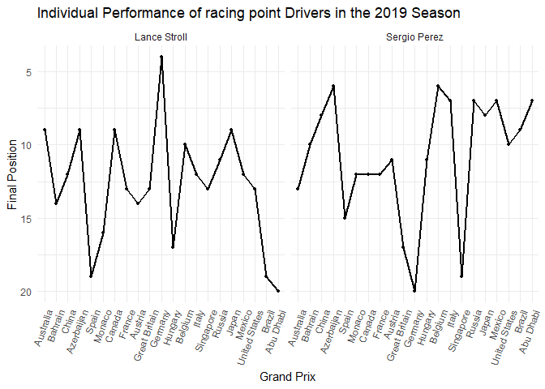
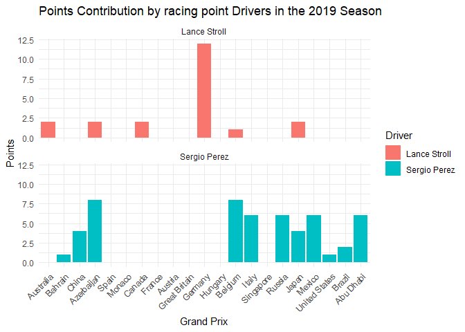
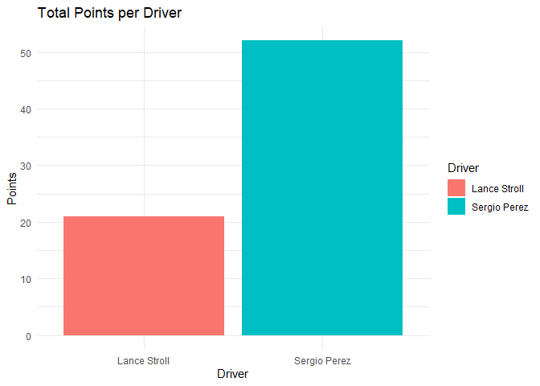
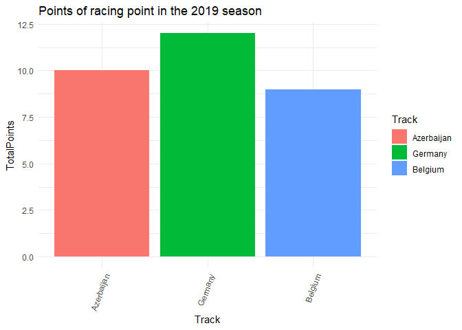
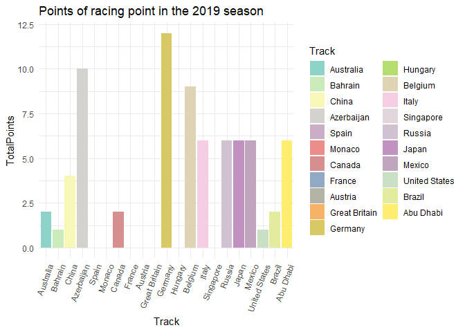
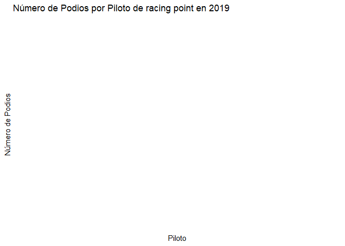

racing point 2019
================
Moises Carrillo
2024-08-17

## Introduction

This report analyzes the performance of the Racing point team in the
2019 Formula 1 season. We examine aspects such as final positions,
points earned, poles, victories, tracks and fastest laps, as well as the
pole-to-victory conversion rate.

# Data loading and preparation

In this part we load the data and we do some cleaning of the database

``` r
f1_2019_results <- read.csv('C:/Users/moise/Analysis_project/formula1_2019season_raceResults.csv')

racing_point_2019 <- f1_2019_results %>%
  filter(Team == "Racing Point BWT Mercedes", ignore.case = TRUE) %>% 
  select(Driver, Position, Points, Track, Starting.Grid, Fastest.Lap)

str(racing_point_2019$Position)
```

    ##  chr [1:42] "9" "13" "10" "14" "8" "12" "6" "9" "15" "NC" "12" "16" "9" ...

``` r
racing_point_2019$Position <- as.numeric(racing_point_2019$Position)
```

    ## Warning: NAs introduced by coercion

``` r
racing_point_2019$Track <- factor(racing_point_2019$Track, levels = unique(f1_2019_results$Track))
racing_point_2019$Position[10] <- 19
racing_point_2019$Position[22] <- 20
racing_point_2019$Position[30] <- 19
racing_point_2019$Position[42] <- 20
racing_point_2019
```

    ##          Driver Position Points         Track Starting.Grid Fastest.Lap
    ## 1  Lance Stroll        9      2     Australia            16          No
    ## 2  Sergio Perez       13      0     Australia            10          No
    ## 3  Sergio Perez       10      1       Bahrain            14          No
    ## 4  Lance Stroll       14      0       Bahrain            18          No
    ## 5  Sergio Perez        8      4         China            12          No
    ## 6  Lance Stroll       12      0         China            16          No
    ## 7  Sergio Perez        6      8    Azerbaijan             5          No
    ## 8  Lance Stroll        9      2    Azerbaijan            13          No
    ## 9  Sergio Perez       15      0         Spain            15          No
    ## 10 Lance Stroll       19      0         Spain            16          No
    ## 11 Sergio Perez       12      0        Monaco            16          No
    ## 12 Lance Stroll       16      0        Monaco            17          No
    ## 13 Lance Stroll        9      2        Canada            17          No
    ## 14 Sergio Perez       12      0        Canada            15          No
    ## 15 Sergio Perez       12      0        France            14          No
    ## 16 Lance Stroll       13      0        France            17          No
    ## 17 Sergio Perez       11      0       Austria            13          No
    ## 18 Lance Stroll       14      0       Austria            14          No
    ## 19 Lance Stroll       13      0 Great Britain            18          No
    ## 20 Sergio Perez       17      0 Great Britain            15          No
    ## 21 Lance Stroll        4     12       Germany            15          No
    ## 22 Sergio Perez       20      0       Germany             8          No
    ## 23 Sergio Perez       11      0       Hungary            16          No
    ## 24 Lance Stroll       17      0       Hungary            18          No
    ## 25 Sergio Perez        6      8       Belgium             7          No
    ## 26 Lance Stroll       10      1       Belgium            16          No
    ## 27 Sergio Perez        7      6         Italy            18          No
    ## 28 Lance Stroll       12      0         Italy             9          No
    ## 29 Lance Stroll       13      0     Singapore            16          No
    ## 30 Sergio Perez       19      0     Singapore            15          No
    ## 31 Sergio Perez        7      6        Russia            11          No
    ## 32 Lance Stroll       11      0        Russia            14          No
    ## 33 Sergio Perez        8      4         Japan            17          No
    ## 34 Lance Stroll        9      2         Japan            12          No
    ## 35 Sergio Perez        7      6        Mexico            11          No
    ## 36 Lance Stroll       12      0        Mexico            16          No
    ## 37 Sergio Perez       10      1 United States            20          No
    ## 38 Lance Stroll       13      0 United States            14          No
    ## 39 Sergio Perez        9      2        Brazil            15          No
    ## 40 Lance Stroll       19      0        Brazil            17          No
    ## 41 Sergio Perez        7      6     Abu Dhabi            10          No
    ## 42 Lance Stroll       20      0     Abu Dhabi            12          No

### Individual driver performance

We analyzed the individual performance of each driver trough the entire
season by visualize their finish position in each race of the 2019
season.

``` r
ggplot(racing_point_2019, aes(x = Track, y = Position, group = Driver)) +
  geom_line(linewidth = 1) +
  geom_point(size = 1) +
  scale_y_reverse() +
  labs(title = "Individual Performance of racing point Drivers in the 2019 Season",
       x = "Grand Prix",
       y = "Final Position") +
  theme_minimal() +
  theme(axis.text.x = element_text(angle = 70, hjust = 1)) +
  facet_wrap(~ Driver)
```

<!-- -->

We see that bout racing point drivers were quite inconsistent trough the
season.

### Points contribution

We analyzed the contribution in points of each driver

``` r
ggplot(racing_point_2019, aes(x = Track, y = Points, fill = Driver)) +
  geom_bar(stat = "identity") +
  labs(title = "Points Contribution by racing point Drivers in the 2019 Season",
       x = "Grand Prix",
       y = "Points") +
  theme_minimal() +
  theme(axis.text.x = element_text(angle = 45, hjust = 1)) +
  facet_wrap(~ Driver, ncol = 1)
```

<!-- -->

Afte r the middle of the season, Sergio perez was more consistent in get
into the points.

## Total points analysis

### Total points by driver

We analyzed the total points that each driver did in the 2019 season

``` r
total_points <- racing_point_2019 %>% 
  group_by(Driver) %>% 
  summarise(Totalpoints = sum(Points, na.rm = TRUE)) 

total_points
```

    ## # A tibble: 2 × 2
    ##   Driver       Totalpoints
    ##   <chr>              <int>
    ## 1 Lance Stroll          21
    ## 2 Sergio Perez          52

``` r
ggplot(total_points, aes(x = Driver, y = Totalpoints, fill = Driver)) +
  geom_bar(stat = 'identity') +
  labs(title = "Total Points per Driver", 
       x = "Driver",
       y = "Points") +
  theme_minimal()
```

<!-- -->

Sergio Perez beats Lance stroll

### Points of the team

Points of the team

``` r
racing_point_points <- racing_point_2019 %>%
  group_by(Track) %>%
  summarise(TotalPoints = sum(Points, na.rm = TRUE)) %>%
  ungroup()

racing_point_points
```

    ## # A tibble: 21 × 2
    ##    Track         TotalPoints
    ##    <fct>               <int>
    ##  1 Australia               2
    ##  2 Bahrain                 1
    ##  3 China                   4
    ##  4 Azerbaijan             10
    ##  5 Spain                   0
    ##  6 Monaco                  0
    ##  7 Canada                  2
    ##  8 France                  0
    ##  9 Austria                 0
    ## 10 Great Britain           0
    ## # ℹ 11 more rows

### Track points

We analyzed which was the circuits were the team score more points

``` r
top_circuits <- racing_point_points %>%
  top_n(3, wt = TotalPoints) %>%
  arrange(desc(TotalPoints))

top_circuits
```

    ## # A tibble: 3 × 2
    ##   Track      TotalPoints
    ##   <fct>            <int>
    ## 1 Germany             12
    ## 2 Azerbaijan          10
    ## 3 Belgium              9

``` r
ggplot(top_circuits, aes(x = Track, y = TotalPoints, fill = Track))+
  geom_bar(stat = "identity")+
  labs(title = "Points of racing point in the 2019 season")+
  theme_minimal() +
  theme(axis.text.x = element_text(angle = 70, hjust = 1))
```

<!-- -->

We see that there were 3 best circuits where the team score the same
amount of points.

### Total pints per track

We analyzed how many points scored racing point per each circuit

``` r
ggplot(racing_point_points, aes(x = Track, y = TotalPoints, fill = Track))+
  geom_bar(stat = "identity")+
  labs(title = "Points of racing point in the 2019 season")+
  theme_minimal() +
  theme(axis.text.x = element_text(angle = 70, hjust = 1))+
  scale_fill_manual(values = colorRampPalette(brewer.pal(12, "Set3"))(21))
```

<!-- -->

### Total points of the season for the team

``` r
total_points_season <- racing_point_2019 %>% 
  summarise(TotalPoints = sum(Points, na.rm = TRUE))

total_points_season
```

    ##   TotalPoints
    ## 1          73

At the end of the season, racing point scored 73 points and that give
them the seventh place in the Constructors championship of the 2019
season of Formula 1

## Analysis of poles and victories

### Number of poles per driver

We analyzed the number of poles that each driver did.

``` r
n_poles <- racing_point_2019 %>% 
  filter(Starting.Grid == 1) %>%
  count(Driver, name = "NumPoles")

n_poles
```

    ## [1] Driver   NumPoles
    ## <0 rows> (or 0-length row.names)

None drivers made Poles

### Track poles

We analyzed in which circuits the drivers made pole position

``` r
racing_point_2019$Track <- as.character(racing_point_2019$Track)#Convert track into a vector

track_poles <- racing_point_2019 %>% 
  filter(Starting.Grid == 1) %>% 
  select(Driver, Track)

track_poles
```

    ## [1] Driver Track 
    ## <0 rows> (or 0-length row.names)

### Number of victories per driver

We analyzed the number of victories that each driver did, and we
compared.

``` r
n_victories <- racing_point_2019 %>% 
  filter(Position == 1) %>%
  count(Driver, name = "NumVictories")

n_victories
```

    ## [1] Driver       NumVictories
    ## <0 rows> (or 0-length row.names)

None drivers got victories

### Track victories

We analyzed in which circuits the drivers got a victories

``` r
n_victories <- racing_point_2019 %>% 
  filter(Position == 1)%>%
  count(Driver, name = "NumVictories")

n_victories
```

    ## [1] Driver       NumVictories
    ## <0 rows> (or 0-length row.names)

### Pole to victory conversion rate

As each driver made pole and victory, we analyzed what was the
conversion rate that each driver made to convert a pole to victory

``` r
poles_victories <- racing_point_2019 %>%
  group_by(Driver) %>% 
  filter(Starting.Grid == 1) %>%
  summarise(TotalPoles = n(),
            PolesConvertedToWins = sum(Position == 1)) %>%
  mutate(ConversionRate = (PolesConvertedToWins / TotalPoles) * 100)

poles_victories
```

    ## # A tibble: 0 × 4
    ## # ℹ 4 variables: Driver <chr>, TotalPoles <int>, PolesConvertedToWins <int>,
    ## #   ConversionRate <dbl>

As there are no poles and victories, there is no conversion.

### Poles and victory

This is for in which circuit the driver made pole and get the victory of
the same race

``` r
poles_and_victorie <- racing_point_2019 %>% 
  filter(Starting.Grid == 1, Position == 1) %>% 
  select(Driver, Track)

poles_and_victorie
```

    ## [1] Driver Track 
    ## <0 rows> (or 0-length row.names)

## Analyze podiums and fastest laps

\#Podiums

We analyzed how many podiums got each driver

``` r
podiums_per_driver <- racing_point_2019 %>%
  group_by(Driver) %>% 
  filter(Position %in% 1:3) %>%
  count(Driver, name = "NumPodiums")

podiums_per_driver
```

    ## # A tibble: 0 × 2
    ## # Groups:   Driver [0]
    ## # ℹ 2 variables: Driver <chr>, NumPodiums <int>

``` r
#Graphs of podiums
ggplot(podiums_per_driver, aes(x = Driver, y = NumPodiums, fill = Driver)) +
  geom_bar(stat = "identity") +
  labs(title = "Número de Podios por Piloto de racing point en 2019",
       x = "Piloto",
       y = "Número de Podios") +
  theme_minimal()
```

<!-- -->

``` r
facet_wrap(~Driver)
```

    ## <ggproto object: Class FacetWrap, Facet, gg>
    ##     compute_layout: function
    ##     draw_back: function
    ##     draw_front: function
    ##     draw_labels: function
    ##     draw_panels: function
    ##     finish_data: function
    ##     init_scales: function
    ##     map_data: function
    ##     params: list
    ##     setup_data: function
    ##     setup_params: function
    ##     shrink: TRUE
    ##     train_scales: function
    ##     vars: function
    ##     super:  <ggproto object: Class FacetWrap, Facet, gg>

None drivers got podiums

### Fastests laps

We analyzed how many fastests laps got each driver.

``` r
fastest_laps_per_driver <- racing_point_2019 %>%
  group_by(Driver) %>% 
  filter(Fastest.Lap == "Yes") %>%
  count(Driver, name = "NumFastestLaps")

fastest_laps_per_driver
```

    ## # A tibble: 0 × 2
    ## # Groups:   Driver [0]
    ## # ℹ 2 variables: Driver <chr>, NumFastestLaps <int>

No fastest laps

# Conclusion

This analysis showcases that bout drivers of Racing point did not have a
great season, only by Sergio perez after the middle of the season, start
to get more consistently into the points, unfortenly there was no at
least a podium for the team.
