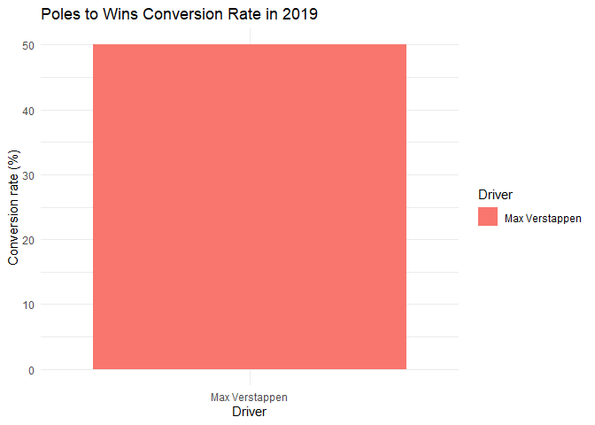

Redbull
================
Moises Carrillo
2024-08-17

## Introduction

This report analyzes the performance of the Red bull team in the 2019
Formula 1 season. We examine aspects such as final positions, points
earned, poles, victories, tracks and fastest laps, as well as the
pole-to-victory conversion rate.

# Data loading and preparation

In this part we load the data and we do some cleaning of the database

``` r
f1_2019_results <- read.csv('C:/Users/moise/Analysis_project/formula1_2019season_raceResults.csv')

redbull_2019 <- f1_2019_results %>% 
  filter(Team == "Red Bull Racing Honda", ignore.case = TRUE) %>% 
  select(Driver, Position, Points, Track, Starting.Grid, Fastest.Lap)

str(redbull_2019$Position)
```

    ##  chr [1:42] "3" "11" "4" "8" "4" "6" "4" "NC" "3" "6" "4" "5" "5" "8" "4" ...

``` r
redbull_2019$Position <- as.numeric(redbull_2019$Position)
```

    ## Warning: NAs introduced by coercion

``` r
redbull_2019$Position[8] <- 17
redbull_2019$Position[26] <- 20
redbull_2019$Position[34] <- 18
redbull_2019$Track <- factor(redbull_2019$Track, levels = unique(f1_2019_results$Track))

redbull_2019
```

    ##             Driver Position Points         Track Starting.Grid Fastest.Lap
    ## 1   Max Verstappen        3     15     Australia             4          No
    ## 2     Pierre Gasly       11      0     Australia            17          No
    ## 3   Max Verstappen        4     12       Bahrain             5          No
    ## 4     Pierre Gasly        8      4       Bahrain            13          No
    ## 5   Max Verstappen        4     12         China             5          No
    ## 6     Pierre Gasly        6      9         China             6         Yes
    ## 7   Max Verstappen        4     12    Azerbaijan             4          No
    ## 8     Pierre Gasly       17      0    Azerbaijan            20          No
    ## 9   Max Verstappen        3     15         Spain             4          No
    ## 10    Pierre Gasly        6      8         Spain             6          No
    ## 11  Max Verstappen        4     12        Monaco             3          No
    ## 12    Pierre Gasly        5     11        Monaco             8         Yes
    ## 13  Max Verstappen        5     10        Canada             9          No
    ## 14    Pierre Gasly        8      4        Canada             5          No
    ## 15  Max Verstappen        4     12        France             4          No
    ## 16    Pierre Gasly       10      1        France             9          No
    ## 17  Max Verstappen        1     26       Austria             2         Yes
    ## 18    Pierre Gasly        7      6       Austria             8          No
    ## 19    Pierre Gasly        4     12 Great Britain             5          No
    ## 20  Max Verstappen        5     10 Great Britain             4          No
    ## 21  Max Verstappen        1     26       Germany             2         Yes
    ## 22    Pierre Gasly       14      0       Germany             4          No
    ## 23  Max Verstappen        2     19       Hungary             1         Yes
    ## 24    Pierre Gasly        6      8       Hungary             6          No
    ## 25 Alexander Albon        5     10       Belgium            17          No
    ## 26  Max Verstappen       20      0       Belgium             5          No
    ## 27 Alexander Albon        6      8         Italy             8          No
    ## 28  Max Verstappen        8      4         Italy            19          No
    ## 29  Max Verstappen        3     15     Singapore             4          No
    ## 30 Alexander Albon        6      8     Singapore             6          No
    ## 31  Max Verstappen        4     12        Russia             9          No
    ## 32 Alexander Albon        5     10        Russia            20          No
    ## 33 Alexander Albon        4     12         Japan             6          No
    ## 34  Max Verstappen       18      0         Japan             5          No
    ## 35 Alexander Albon        5     10        Mexico             5          No
    ## 36  Max Verstappen        6      8        Mexico             4          No
    ## 37  Max Verstappen        3     15 United States             3          No
    ## 38 Alexander Albon        5     10 United States             6          No
    ## 39  Max Verstappen        1     25        Brazil             1          No
    ## 40 Alexander Albon       14      0        Brazil             5          No
    ## 41  Max Verstappen        2     18     Abu Dhabi             2          No
    ## 42 Alexander Albon        6      8     Abu Dhabi             5          No

### Individual driver performance

We analyzed the individual performance of each driver trough the entire
season by visualize their finish position in each race of the 2019
season.

<!-- -->

In this case there are there driver of redbull, the reason is because
Pierre Gasly was fired after the Hungary GP, because not give the
expected results that the team expected. \### Points contribution

We analyzed the contribution in points of each driver

``` r
ggplot(redbull_2019, aes(x = Track, y = Points, fill = Driver)) +
  geom_bar(stat = "identity") +
  labs(title = "Red Bull Driver Points Contribution in 2019 Season",
       x = "Grand prix",
       y = "Points") +
  theme_minimal() +
  theme(axis.text.x = element_text(angle = 45, hjust = 1)) +
  facet_wrap(~ Driver, ncol = 1)
```

<!-- -->

In this graph we see why Gasly was fired, he was not the same consisten
as Max verstappen was.

## Total points analysis

### Total points by driver

We analyzed the total points that each driver did in the 2019 season.

``` r
total_points <- redbull_2019 %>% 
  group_by(Driver) %>% 
  summarise(Totalpoints = sum(Points, na.rm = TRUE)) 

total_points
```

    ## # A tibble: 3 × 2
    ##   Driver          Totalpoints
    ##   <chr>                 <int>
    ## 1 Alexander Albon          76
    ## 2 Max Verstappen          278
    ## 3 Pierre Gasly             63

``` r
ggplot(total_points, aes(x = Driver, y = Totalpoints, fill = Driver)) +
  geom_bar(stat = 'identity') +
  labs(title = "Total Points per Driver", 
       x = "Driver",
       y = "Points") +
  theme_minimal()
```

<!-- -->

Alex Albon scored more points that Pierre Gasly.

### Points of the team

Points of the team

``` r
redbull_points <- redbull_2019 %>%
  group_by(Track) %>%
  summarise(TotalPoints = sum(Points, na.rm = TRUE)) %>%
  ungroup()

redbull_points
```

    ## # A tibble: 21 × 2
    ##    Track         TotalPoints
    ##    <fct>               <int>
    ##  1 Australia              15
    ##  2 Bahrain                16
    ##  3 China                  21
    ##  4 Azerbaijan             12
    ##  5 Spain                  23
    ##  6 Monaco                 23
    ##  7 Canada                 14
    ##  8 France                 13
    ##  9 Austria                32
    ## 10 Great Britain          22
    ## # ℹ 11 more rows

### Track points

We analyzed which was the circuits were the team score more points.

``` r
top_circuits <- redbull_points %>%
  top_n(3, wt = TotalPoints) %>%
  arrange(desc(TotalPoints))

top_circuits
```

    ## # A tibble: 4 × 2
    ##   Track     TotalPoints
    ##   <fct>           <int>
    ## 1 Austria            32
    ## 2 Hungary            27
    ## 3 Germany            26
    ## 4 Abu Dhabi          26

``` r
ggplot(top_circuits, aes(x = Track, y = TotalPoints, fill = Track))+
  geom_bar(stat = "identity")+
  labs(title = "Points of Redbull in the 2019 season")+
  theme_minimal() +
  theme(axis.text.x = element_text(angle = 70, hjust = 1))
```

<!-- -->

The best circuits for redbull

### Total pints per track

We analyzed how many points scored Mercedes per each circuit.

``` r
ggplot(redbull_points, aes(x = Track, y = TotalPoints, fill = Track))+
  geom_bar(stat = "identity")+
  labs(title = "Points of redbull in the 2019 season")+
  theme_minimal() +
  theme(axis.text.x = element_text(angle = 70, hjust = 1))+
  scale_fill_manual(values = colorRampPalette(brewer.pal(12, "Set3"))(21))
```

<!-- -->

### Total points of the season for the team

``` r
total_points_season <- redbull_2019 %>% 
  summarise(TotalPoints = sum(Points, na.rm = TRUE))

total_points_season
```

    ##   TotalPoints
    ## 1         417

At the end Redbull scored 417 points for be the third team in the
constructors champioship.

### Number of poles per driver

We analyzed the number of poles that each driver did.

``` r
n_poles <- redbull_2019 %>% 
  filter(Starting.Grid == 1)%>%
  count(Driver, name = "NumPoles")

n_poles
```

    ##           Driver NumPoles
    ## 1 Max Verstappen        2

``` r
#graphs of poles
ggplot(n_poles, aes(x = Driver, y = NumPoles, fill = Driver)) +
  geom_bar(stat = "identity") +
  labs(title = "Number of Poles per Red Bull Driver in 2019",
       x = "Driver",
       y = "Poles number") +
  theme_minimal()
```

<!-- -->

We saw that Max verstappen was the only one of the three drivers to get
a Pole position

### Track poles

We analyzed in which circuits the drivers made pole position

``` r
redbull_2019$Track <- as.character(redbull_2019$Track)#Convert track into a vector

track_poles <- redbull_2019 %>% 
  filter(Starting.Grid == 1) %>% 
  select(Driver, Track)

track_poles
```

    ##           Driver   Track
    ## 1 Max Verstappen Hungary
    ## 2 Max Verstappen  Brazil

The two circuits where Verstappen made Pole

### Number of victories per driver

We analyzed the number of victories that each driver did, and we
compared.

``` r
n_victories <- redbull_2019 %>% 
  filter(Position == 1)%>%
  count(Driver, name = "NumVictories")

n_victories
```

    ##           Driver NumVictories
    ## 1 Max Verstappen            3

``` r
#graphs of victories
ggplot(n_victories, aes(x = Driver, y=NumVictories, fill = Driver))+
  geom_bar(stat="identity")+
  labs(title = "Number of victories for each driver in 2019",
       x = "Driver",
       y = "Number of victories")+
  theme_linedraw()
```

<!-- -->

Also Verstappen was the only one to got a victory.

### Track victories

We analyzed in which circuits the drivers got a victories

``` r
track_win <- redbull_2019 %>% 
  filter(Position == 1) %>% 
  select(Driver, Track)

track_win
```

    ##           Driver   Track
    ## 1 Max Verstappen Austria
    ## 2 Max Verstappen Germany
    ## 3 Max Verstappen  Brazil

The circuits where Verstappen got a victory

### Pole to victory conversion rate

As each driver made pole and victory, we analyzed what was the
conversion rate that each driver made to convert a pole to victory

``` r
#poles and victory
poles_and_victorie <- redbull_2019 %>% 
  filter(Starting.Grid == 1, Position == 1) %>% 
  select(Driver, Track)

poles_and_victorie
```

    ##           Driver  Track
    ## 1 Max Verstappen Brazil

``` r
#poles to victorie
poles_victories <- redbull_2019 %>%
  group_by(Driver) %>% 
  filter(Starting.Grid == 1) %>%
  summarise(TotalPoles = n(),
            PolesConvertedToWins = sum(Position == 1)) %>%
  mutate(ConversionRate = (PolesConvertedToWins / TotalPoles) * 100)

poles_victories
```

    ## # A tibble: 1 × 4
    ##   Driver         TotalPoles PolesConvertedToWins ConversionRate
    ##   <chr>               <int>                <int>          <dbl>
    ## 1 Max Verstappen          2                    1             50

``` r
#graph of conversion
ggplot(poles_victories, aes(x = Driver, y = ConversionRate, fill = Driver)) +
  geom_bar(stat = "identity") +
  labs(title = "Poles to Wins Conversion Rate in 2019",
       x = "Driver",
       y = "Conversion rate (%)") +
  theme_minimal()
```

<!-- -->

We see which was the circuit where Verstappen convert his pole to
victory, and we see that the only one where he convert it was in the
Brazil GP.

## Analyze podiums and fastest laps

\#Podiums

We analyzed how many podiums got each driver.

``` r
podiums_per_driver <- redbull_2019 %>%
  group_by(Driver) %>% 
  filter(Position %in% 1:3) %>%
  count(Driver, name = "NumPodiums")

podiums_per_driver
```

    ## # A tibble: 1 × 2
    ## # Groups:   Driver [1]
    ##   Driver         NumPodiums
    ##   <chr>               <int>
    ## 1 Max Verstappen          9

``` r
#Graphs of podiums
ggplot(podiums_per_driver, aes(x = Driver, y = NumPodiums, fill = Driver)) +
  geom_bar(stat = "identity") +
  labs(title = "Number of podiums per Red Bull driver in 2019",
       x = "Driver",
       y = "Number of podiums") +
  theme_minimal()
```

<!-- -->

Also Verstappen was the only one to scored podiums.

### Fastests laps

We analyzed how many fastests laps got each driver.

``` r
fastest_laps_per_driver <- redbull_2019 %>%
  group_by(Driver) %>% 
  filter(Fastest.Lap == "Yes") %>%
  count(Driver, name = "NumFastestLaps")

fastest_laps_per_driver
```

    ## # A tibble: 2 × 2
    ## # Groups:   Driver [2]
    ##   Driver         NumFastestLaps
    ##   <chr>                   <int>
    ## 1 Max Verstappen              3
    ## 2 Pierre Gasly                2

``` r
#graphs of fastest laps
ggplot(fastest_laps_per_driver, aes(x = Driver, y = NumFastestLaps, fill = Driver)) +
  geom_bar(stat = "identity") +
  labs(title = "Number of Fastest Laps by Red Bull Driver in 2019",
       x = "Driver",
       y = "Number of fastest laps") +
  theme_minimal()
```

<!-- -->

``` r
facet_wrap(~Driver)
```

    ## <ggproto object: Class FacetWrap, Facet, gg>
    ##     compute_layout: function
    ##     draw_back: function
    ##     draw_front: function
    ##     draw_labels: function
    ##     draw_panels: function
    ##     finish_data: function
    ##     init_scales: function
    ##     map_data: function
    ##     params: list
    ##     setup_data: function
    ##     setup_params: function
    ##     shrink: TRUE
    ##     train_scales: function
    ##     vars: function
    ##     super:  <ggproto object: Class FacetWrap, Facet, gg>

Verstappen and Gasly made fastests laps.

# Conclusion

This analysis showcases the consistency of Max Verstappen in scored
Podiums, Poles and victories, he was the only driver to do it, only
Gasly show in the part of fastests laps, and we saw that Albon scored
more points than him.
