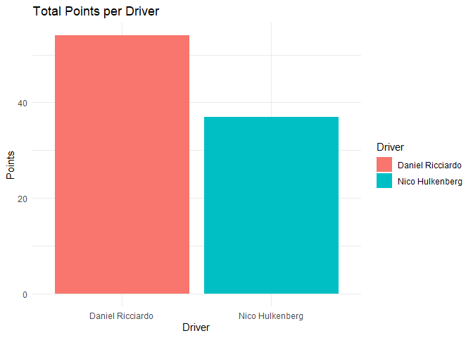

Renault 2019
================
Moises Carrillo
2024-08-17

## Introduction

This report analyzes the performance of the Renault team in the 2019
Formula 1 season. We examine aspects such as final positions, points
earned, poles, victories, tracks and fastest laps, as well as the
pole-to-victory conversion rate.

# Data loading and preparation

In this part we load the data and we do some cleaning of the database

``` r
f1_2019_results <- read.csv('C:/Users/moise/Analysis_project/formula1_2019season_raceResults.csv')

renault_2019 <- f1_2019_results %>%
  filter(Team == "Renault", ignore.case = TRUE) %>% 
  select(Driver, Position, Points, Track, Starting.Grid, Fastest.Lap)

str(renault_2019$Position)
```

    ##  chr [1:42] "7" "NC" "17" "18" "7" "NC" "14" "NC" "12" "13" "9" "13" "6" ...

``` r
renault_2019$Position <- as.numeric(renault_2019$Position)
```

    ## Warning: NAs introduced by coercion

``` r
renault_2019$Track <- factor(renault_2019$Track, levels = unique(f1_2019_results$Track))
renault_2019$Position[2] <- 19
renault_2019$Position[6] <- 20
renault_2019$Position[8] <- 20
renault_2019$Position[21] <- 16
renault_2019$Position[22] <- 19
renault_2019$Position[32] <- 19
renault_2019$Position[33] <- 19
renault_2019$Position[34] <- 20
renault_2019
```

    ##              Driver Position Points         Track Starting.Grid Fastest.Lap
    ## 1   Nico Hulkenberg        7      6     Australia            11          No
    ## 2  Daniel Ricciardo       19      0     Australia            12          No
    ## 3   Nico Hulkenberg       17      0       Bahrain            17          No
    ## 4  Daniel Ricciardo       18      0       Bahrain            10          No
    ## 5  Daniel Ricciardo        7      6         China             7          No
    ## 6   Nico Hulkenberg       20      0         China             8          No
    ## 7   Nico Hulkenberg       14      0    Azerbaijan            15          No
    ## 8  Daniel Ricciardo       20      0    Azerbaijan            10          No
    ## 9  Daniel Ricciardo       12      0         Spain            13          No
    ## 10  Nico Hulkenberg       13      0         Spain            20          No
    ## 11 Daniel Ricciardo        9      2        Monaco             6          No
    ## 12  Nico Hulkenberg       13      0        Monaco            11          No
    ## 13 Daniel Ricciardo        6      8        Canada             4          No
    ## 14  Nico Hulkenberg        7      6        Canada             7          No
    ## 15  Nico Hulkenberg        8      4        France            13          No
    ## 16 Daniel Ricciardo       11      0        France             8          No
    ## 17 Daniel Ricciardo       12      0       Austria            12          No
    ## 18  Nico Hulkenberg       13      0       Austria            15          No
    ## 19 Daniel Ricciardo        7      6 Great Britain             7          No
    ## 20  Nico Hulkenberg       10      1 Great Britain            10          No
    ## 21  Nico Hulkenberg       16      0       Germany             9          No
    ## 22 Daniel Ricciardo       19      0       Germany            13          No
    ## 23  Nico Hulkenberg       12      0       Hungary            11          No
    ## 24 Daniel Ricciardo       14      0       Hungary            20          No
    ## 25  Nico Hulkenberg        8      4       Belgium            12          No
    ## 26 Daniel Ricciardo       14      0       Belgium            10          No
    ## 27 Daniel Ricciardo        4     12         Italy             5          No
    ## 28  Nico Hulkenberg        5     10         Italy             6          No
    ## 29  Nico Hulkenberg        9      2     Singapore             8          No
    ## 30 Daniel Ricciardo       14      0     Singapore            20          No
    ## 31  Nico Hulkenberg       10      1        Russia             6          No
    ## 32 Daniel Ricciardo       19      0        Russia            10          No
    ## 33 Daniel Ricciardo       19      0         Japan            16          No
    ## 34  Nico Hulkenberg       20      0         Japan            15          No
    ## 35 Daniel Ricciardo        8      4        Mexico            13          No
    ## 36  Nico Hulkenberg       10      1        Mexico            12          No
    ## 37 Daniel Ricciardo        6      8 United States             9          No
    ## 38  Nico Hulkenberg        9      2 United States            11          No
    ## 39 Daniel Ricciardo        6      8        Brazil            11          No
    ## 40  Nico Hulkenberg       15      0        Brazil            13          No
    ## 41 Daniel Ricciardo       11      0     Abu Dhabi             7          No
    ## 42  Nico Hulkenberg       12      0     Abu Dhabi             9          No

### Individual driver performance

We analyzed the individual performance of each driver trough the entire
season by visualize their finish position in each race of the 2019
season.

``` r
ggplot(renault_2019, aes(x = Track, y = Position, group = Driver)) +
  geom_line(linewidth = 1) +
  geom_point(size = 1) +
  scale_y_reverse() +
  labs(title = "Individual Performance of Renault Drivers in the 2019 Season",
       x = "Grand Prix",
       y = "Final Position") +
  theme_minimal() +
  theme(axis.text.x = element_text(angle = 70, hjust = 1)) +
  facet_wrap(~ Driver)
```

<!-- -->

We see that bout Renault drivers were quite inconsistent trough the
season.

### Points contribution

We analyzed the contribution in points of each driver

``` r
ggplot(renault_2019, aes(x = Track, y = Points, fill = Driver)) +
  geom_bar(stat = "identity") +
  labs(title = "Points Contribution by Renault Drivers in the 2019 Season",
       x = "Grand Prix",
       y = "Points") +
  theme_minimal() +
  theme(axis.text.x = element_text(angle = 45, hjust = 1)) +
  facet_wrap(~ Driver, ncol = 1)
```

<!-- -->

Even the inconsisten, bout Renault drivers were able to get victories.

## Total points analysis

### Total points by driver

We analyzed the total points that each driver did in the 2019 season

``` r
total_points <- renault_2019 %>% 
  group_by(Driver) %>% 
  summarise(Totalpoints = sum(Points, na.rm = TRUE)) 

total_points
```

    ## # A tibble: 2 × 2
    ##   Driver           Totalpoints
    ##   <chr>                  <int>
    ## 1 Daniel Ricciardo          54
    ## 2 Nico Hulkenberg           37

``` r
ggplot(total_points, aes(x = Driver, y = Totalpoints, fill = Driver)) +
  geom_bar(stat = 'identity') +
  labs(title = "Total Points per Driver", 
       x = "Driver",
       y = "Points") +
  theme_minimal()
```

<!-- -->

In his first season with Renault Charles Leclerc beats Sebastian Vettel
who was a 4 world championship.

### Points of the team

Points of the team

``` r
renault_points <- renault_2019 %>%
  group_by(Track) %>%
  summarise(TotalPoints = sum(Points, na.rm = TRUE)) %>%
  ungroup()

renault_points
```

    ## # A tibble: 21 × 2
    ##    Track         TotalPoints
    ##    <fct>               <int>
    ##  1 Australia               6
    ##  2 Bahrain                 0
    ##  3 China                   6
    ##  4 Azerbaijan              0
    ##  5 Spain                   0
    ##  6 Monaco                  2
    ##  7 Canada                 14
    ##  8 France                  4
    ##  9 Austria                 0
    ## 10 Great Britain           7
    ## # ℹ 11 more rows

### Track points

We analyzed which was the circuits were the team score more points

``` r
top_circuits <- renault_points %>%
  top_n(3, wt = TotalPoints) %>%
  arrange(desc(TotalPoints))

top_circuits
```

    ## # A tibble: 3 × 2
    ##   Track         TotalPoints
    ##   <fct>               <int>
    ## 1 Italy                  22
    ## 2 Canada                 14
    ## 3 United States          10

``` r
ggplot(top_circuits, aes(x = Track, y = TotalPoints, fill = Track))+
  geom_bar(stat = "identity")+
  labs(title = "Points of Renault in the 2019 season")+
  theme_minimal() +
  theme(axis.text.x = element_text(angle = 70, hjust = 1))
```

<!-- -->

We see that there were 3 best circuits where the team score the same
amount of points.

### Total pints per track

We analyzed how many points scored Renault per each circuit

``` r
ggplot(renault_points, aes(x = Track, y = TotalPoints, fill = Track))+
  geom_bar(stat = "identity")+
  labs(title = "Points of Renault in the 2019 season")+
  theme_minimal() +
  theme(axis.text.x = element_text(angle = 70, hjust = 1))+
  scale_fill_manual(values = colorRampPalette(brewer.pal(12, "Set3"))(21))
```

<!-- -->

### Total points of the season for the team

``` r
total_points_season <- renault_2019 %>% 
  summarise(TotalPoints = sum(Points, na.rm = TRUE))

total_points_season
```

    ##   TotalPoints
    ## 1          91

At the end of the season, Renault scored 91 points and that give them
the fifth place in the Constructors championship of the 2019 season of
Formula 1

## Analysis of poles and victories

### Number of poles per driver

We analyzed the number of poles that each driver did.

``` r
n_poles <- renault_2019 %>% 
  filter(Starting.Grid == 1) %>%
  count(Driver, name = "NumPoles")

n_poles
```

    ## [1] Driver   NumPoles
    ## <0 rows> (or 0-length row.names)

Any of the drivers get poles

### Track poles

We analyzed in which circuits the drivers made pole position

``` r
renault_2019$Track <- as.character(renault_2019$Track)#Convert track into a vector

track_poles <- renault_2019 %>% 
  filter(Starting.Grid == 1) %>% 
  select(Driver, Track)

track_poles
```

    ## [1] Driver Track 
    ## <0 rows> (or 0-length row.names)

### Number of victories per driver

We analyzed the number of victories that each driver did, and we
compared.

``` r
n_victories <- renault_2019 %>% 
  filter(Position == 1) %>%
  count(Driver, name = "NumVictories")

n_victories
```

    ## [1] Driver       NumVictories
    ## <0 rows> (or 0-length row.names)

Any driver get victories

### Track victories

We analyzed in which circuits the drivers got a victories

``` r
n_victories <- renault_2019 %>% 
  filter(Position == 1)%>%
  count(Driver, name = "NumVictories")

n_victories
```

    ## [1] Driver       NumVictories
    ## <0 rows> (or 0-length row.names)

### Pole to victory conversion rate

As each driver made pole and victory, we analyzed what was the
conversion rate that each driver made to convert a pole to victory

``` r
poles_victories <- renault_2019 %>%
  group_by(Driver) %>% 
  filter(Starting.Grid == 1) %>%
  summarise(TotalPoles = n(),
            PolesConvertedToWins = sum(Position == 1)) %>%
  mutate(ConversionRate = (PolesConvertedToWins / TotalPoles) * 100)

poles_victories
```

    ## # A tibble: 0 × 4
    ## # ℹ 4 variables: Driver <chr>, TotalPoles <int>, PolesConvertedToWins <int>,
    ## #   ConversionRate <dbl>

As they did not get poles and victories, there is no conversion

### Poles and victory

This is for in which circuit the driver made pole and get the victory of
the same race

``` r
poles_and_victorie <- renault_2019 %>% 
  filter(Starting.Grid == 1, Position == 1) %>% 
  select(Driver, Track)

poles_and_victorie
```

    ## [1] Driver Track 
    ## <0 rows> (or 0-length row.names)

## Analyze podiums and fastest laps

\#Podiums

We analyzed how many podiums got each driver

``` r
podiums_per_driver <- renault_2019 %>%
  group_by(Driver) %>% 
  filter(Position %in% 1:3) %>%
  count(Driver, name = "NumPodiums")

podiums_per_driver
```

    ## # A tibble: 0 × 2
    ## # Groups:   Driver [0]
    ## # ℹ 2 variables: Driver <chr>, NumPodiums <int>

Also any driver got podiums

### Fastests laps

We analyzed how many fastests laps got each driver.

``` r
fastest_laps_per_driver <- renault_2019 %>%
  group_by(Driver) %>% 
  filter(Fastest.Lap == "Yes") %>%
  count(Driver, name = "NumFastestLaps")

fastest_laps_per_driver
```

    ## # A tibble: 0 × 2
    ## # Groups:   Driver [0]
    ## # ℹ 2 variables: Driver <chr>, NumFastestLaps <int>

None of them made fastests laps

# Conclusion

This analysis showcases that bout drivers were inconsistent trough the
season and that make that the team did not scored too much points
