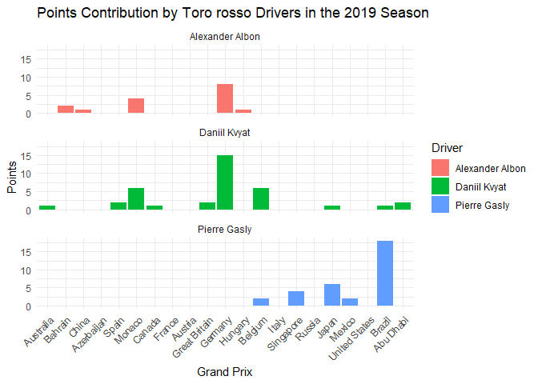

Toro rosso 2019
================
Moises Carrillo
2024-08-17

## Introduction

This report analyzes the performance of the Toro rosso team in the 2019
Formula 1 season. We examine aspects such as final positions, points
earned, poles, victories, tracks and fastest laps, as well as the
pole-to-victory conversion rate.

# Data loading and preparation

In this part we load the data and we do some cleaning of the database

``` r
f1_2019_results <- read.csv('C:/Users/moise/Analysis_project/formula1_2019season_raceResults.csv')

toro_rosso_2019 <- f1_2019_results %>%
  filter(Team == "Scuderia Toro Rosso Honda", ignore.case = TRUE) %>% 
  select(Driver, Position, Points, Track, Starting.Grid, Fastest.Lap)

str(toro_rosso_2019$Position)
```

    ##  chr [1:42] "10" "14" "9" "12" "10" "NC" "11" "NC" "9" "11" "7" "8" "10" ...

``` r
toro_rosso_2019$Position <- as.numeric(toro_rosso_2019$Position)
```

    ## Warning: NAs introduced by coercion

``` r
toro_rosso_2019$Track <- factor(toro_rosso_2019$Track, levels = unique(f1_2019_results$Track))
toro_rosso_2019$Position[6] <- 19
toro_rosso_2019$Position[8] <- 19
toro_rosso_2019$Position[14] <- 19
toro_rosso_2019$Position[28] <- 19
toro_rosso_2019
```

    ##             Driver Position Points         Track Starting.Grid Fastest.Lap
    ## 1     Daniil Kvyat       10      1     Australia            15          No
    ## 2  Alexander Albon       14      0     Australia            13          No
    ## 3  Alexander Albon        9      2       Bahrain            12          No
    ## 4     Daniil Kvyat       12      0       Bahrain            15          No
    ## 5  Alexander Albon       10      1         China            20          No
    ## 6     Daniil Kvyat       19      0         China            11          No
    ## 7  Alexander Albon       11      0    Azerbaijan            11          No
    ## 8     Daniil Kvyat       19      0    Azerbaijan             6          No
    ## 9     Daniil Kvyat        9      2         Spain             9          No
    ## 10 Alexander Albon       11      0         Spain            11          No
    ## 11    Daniil Kvyat        7      6        Monaco             7          No
    ## 12 Alexander Albon        8      4        Monaco            10          No
    ## 13    Daniil Kvyat       10      1        Canada            10          No
    ## 14 Alexander Albon       19      0        Canada            13          No
    ## 15    Daniil Kvyat       14      0        France            19          No
    ## 16 Alexander Albon       15      0        France            11          No
    ## 17 Alexander Albon       15      0       Austria            18          No
    ## 18    Daniil Kvyat       17      0       Austria            16          No
    ## 19    Daniil Kvyat        9      2 Great Britain            17          No
    ## 20 Alexander Albon       12      0 Great Britain             9          No
    ## 21    Daniil Kvyat        3     15       Germany            14          No
    ## 22 Alexander Albon        6      8       Germany            16          No
    ## 23 Alexander Albon       10      1       Hungary            12          No
    ## 24    Daniil Kvyat       15      0       Hungary            13          No
    ## 25    Daniil Kvyat        7      6       Belgium            19          No
    ## 26    Pierre Gasly        9      2       Belgium            13          No
    ## 27    Pierre Gasly       11      0         Italy            17          No
    ## 28    Daniil Kvyat       19      0         Italy            12          No
    ## 29    Pierre Gasly        8      4     Singapore            11          No
    ## 30    Daniil Kvyat       15      0     Singapore            14          No
    ## 31    Daniil Kvyat       12      0        Russia            19          No
    ## 32    Pierre Gasly       14      0        Russia            16          No
    ## 33    Pierre Gasly        7      6         Japan             9          No
    ## 34    Daniil Kvyat       10      1         Japan            14          No
    ## 35    Pierre Gasly        9      2        Mexico            10          No
    ## 36    Daniil Kvyat       11      0        Mexico             9          No
    ## 37    Daniil Kvyat       12      0 United States            13          No
    ## 38    Pierre Gasly       16      0 United States            10          No
    ## 39    Pierre Gasly        2     18        Brazil             6          No
    ## 40    Daniil Kvyat       10      1        Brazil            16          No
    ## 41    Daniil Kvyat        9      2     Abu Dhabi            13          No
    ## 42    Pierre Gasly       18      0     Abu Dhabi            11          No

### Individual driver performance

We analyzed the individual performance of each driver trough the entire
season by visualize their finish position in each race of the 2019
season.

``` r
ggplot(toro_rosso_2019, aes(x = Track, y = Position, group = Driver)) +
  geom_line(linewidth = 1) +
  geom_point(size = 1) +
  scale_y_reverse() +
  labs(title = "Individual Performance of Toro rosso Drivers in the 2019 Season",
       x = "Grand Prix",
       y = "Final Position") +
  theme_minimal() +
  theme(axis.text.x = element_text(angle = 70, hjust = 1)) +
  facet_wrap(~ Driver)
```

<!-- -->

We see that there is also the same drivers that were with Red bull, this
is because, Toro rosso is the small team of Redbull.

### Points contribution

We analyzed the contribution in points of each driver

``` r
ggplot(toro_rosso_2019, aes(x = Track, y = Points, fill = Driver)) +
  geom_bar(stat = "identity") +
  labs(title = "Points Contribution by Toro rosso Drivers in the 2019 Season",
       x = "Grand Prix",
       y = "Points") +
  theme_minimal() +
  theme(axis.text.x = element_text(angle = 45, hjust = 1)) +
  facet_wrap(~ Driver, ncol = 1)
```

<!-- -->

Gasly get into the points more times with toro rosso, than with Redbull,
and Daniel Kyviat was consistent trough the season

## Total points analysis

### Total points by driver

We analyzed the total points that each driver did in the 2019 season

``` r
total_points <- toro_rosso_2019 %>% 
  group_by(Driver) %>% 
  summarise(Totalpoints = sum(Points, na.rm = TRUE)) 

total_points
```

    ## # A tibble: 3 × 2
    ##   Driver          Totalpoints
    ##   <chr>                 <int>
    ## 1 Alexander Albon          16
    ## 2 Daniil Kvyat             37
    ## 3 Pierre Gasly             32

``` r
ggplot(total_points, aes(x = Driver, y = Totalpoints, fill = Driver)) +
  geom_bar(stat = 'identity') +
  labs(title = "Total Points per Driver", 
       x = "Driver",
       y = "Points") +
  theme_minimal()
```

<!-- -->

Gasly almost beats his full time with the team, Daniel Kyviat

### Points of the team

Points of the team

``` r
toro_rosso_points <- toro_rosso_2019 %>%
  group_by(Track) %>%
  summarise(TotalPoints = sum(Points, na.rm = TRUE)) %>%
  ungroup()

toro_rosso_points
```

    ## # A tibble: 21 × 2
    ##    Track         TotalPoints
    ##    <fct>               <int>
    ##  1 Australia               1
    ##  2 Bahrain                 2
    ##  3 China                   1
    ##  4 Azerbaijan              0
    ##  5 Spain                   2
    ##  6 Monaco                 10
    ##  7 Canada                  1
    ##  8 France                  0
    ##  9 Austria                 0
    ## 10 Great Britain           2
    ## # ℹ 11 more rows

### Track points

We analyzed which was the circuits were the team score more points

``` r
top_circuits <- toro_rosso_points %>%
  top_n(3, wt = TotalPoints) %>%
  arrange(desc(TotalPoints))

top_circuits
```

    ## # A tibble: 3 × 2
    ##   Track   TotalPoints
    ##   <fct>         <int>
    ## 1 Germany          23
    ## 2 Brazil           19
    ## 3 Monaco           10

``` r
ggplot(top_circuits, aes(x = Track, y = TotalPoints, fill = Track))+
  geom_bar(stat = "identity")+
  labs(title = "Points of Toro rosso in the 2019 season")+
  theme_minimal() +
  theme(axis.text.x = element_text(angle = 70, hjust = 1))
```

<!-- -->

We see that there were 4 best circuits where the team score the same
amount of points.

### Total pints per track

We analyzed how many points scored Toro rosso per each circuit

``` r
ggplot(toro_rosso_points, aes(x = Track, y = TotalPoints, fill = Track))+
  geom_bar(stat = "identity")+
  labs(title = "Points of Toro rosso in the 2019 season")+
  theme_minimal() +
  theme(axis.text.x = element_text(angle = 70, hjust = 1))+
  scale_fill_manual(values = colorRampPalette(brewer.pal(12, "Set3"))(21))
```

<!-- -->

### Total points of the season for the team

``` r
total_points_season <- toro_rosso_2019 %>% 
  summarise(TotalPoints = sum(Points, na.rm = TRUE))

total_points_season
```

    ##   TotalPoints
    ## 1          85

At the end of the season, Toro rosso scored 85 points and that give them
the sixth place in the Constructors championship of the 2019 season of
Formula 1

## Analysis of poles and victories

### Number of poles per driver

We analyzed the number of poles that each driver did.

``` r
n_poles <- toro_rosso_2019 %>% 
  filter(Starting.Grid == 1) %>%
  count(Driver, name = "NumPoles")

n_poles
```

    ## [1] Driver   NumPoles
    ## <0 rows> (or 0-length row.names)

None drivers made Poles

### Track poles

We analyzed in which circuits the drivers made pole position

``` r
toro_rosso_2019$Track <- as.character(toro_rosso_2019$Track)#Convert track into a vector

track_poles <- toro_rosso_2019 %>% 
  filter(Starting.Grid == 1) %>% 
  select(Driver, Track)

track_poles
```

    ## [1] Driver Track 
    ## <0 rows> (or 0-length row.names)

### Number of victories per driver

We analyzed the number of victories that each driver did, and we
compared.

``` r
n_victories <- toro_rosso_2019 %>% 
  filter(Position == 1) %>%
  count(Driver, name = "NumVictories")

n_victories
```

    ## [1] Driver       NumVictories
    ## <0 rows> (or 0-length row.names)

None drivers got victories

### Track victories

We analyzed in which circuits the drivers got a victories

``` r
n_victories <- toro_rosso_2019 %>% 
  filter(Position == 1)%>%
  count(Driver, name = "NumVictories")

n_victories
```

    ## [1] Driver       NumVictories
    ## <0 rows> (or 0-length row.names)

### Pole to victory conversion rate

As each driver made pole and victory, we analyzed what was the
conversion rate that each driver made to convert a pole to victory

``` r
poles_victories <- toro_rosso_2019 %>%
  group_by(Driver) %>% 
  filter(Starting.Grid == 1) %>%
  summarise(TotalPoles = n(),
            PolesConvertedToWins = sum(Position == 1)) %>%
  mutate(ConversionRate = (PolesConvertedToWins / TotalPoles) * 100)

poles_victories
```

    ## # A tibble: 0 × 4
    ## # ℹ 4 variables: Driver <chr>, TotalPoles <int>, PolesConvertedToWins <int>,
    ## #   ConversionRate <dbl>

As there are no poles and victories, there is no conversion.

### Poles and victory

This is for in which circuit the driver made pole and get the victory of
the same race

``` r
poles_and_victorie <- toro_rosso_2019 %>% 
  filter(Starting.Grid == 1, Position == 1) %>% 
  select(Driver, Track)

poles_and_victorie
```

    ## [1] Driver Track 
    ## <0 rows> (or 0-length row.names)

## Analyze podiums and fastest laps

\#Podiums

We analyzed how many podiums got each driver

``` r
podiums_per_driver <- toro_rosso_2019 %>%
  group_by(Driver) %>% 
  filter(Position %in% 1:3) %>%
  count(Driver, name = "NumPodiums")

podiums_per_driver
```

    ## # A tibble: 2 × 2
    ## # Groups:   Driver [2]
    ##   Driver       NumPodiums
    ##   <chr>             <int>
    ## 1 Daniil Kvyat          1
    ## 2 Pierre Gasly          1

``` r
#Graphs of podiums
ggplot(podiums_per_driver, aes(x = Driver, y = NumPodiums, fill = Driver)) +
  geom_bar(stat = "identity") +
  labs(title = "Número de Podios por Piloto de Toro rosso en 2019",
       x = "Piloto",
       y = "Número de Podios") +
  theme_minimal()
```

<!-- -->

``` r
facet_wrap(~Driver)
```

    ## <ggproto object: Class FacetWrap, Facet, gg>
    ##     compute_layout: function
    ##     draw_back: function
    ##     draw_front: function
    ##     draw_labels: function
    ##     draw_panels: function
    ##     finish_data: function
    ##     init_scales: function
    ##     map_data: function
    ##     params: list
    ##     setup_data: function
    ##     setup_params: function
    ##     shrink: TRUE
    ##     train_scales: function
    ##     vars: function
    ##     super:  <ggproto object: Class FacetWrap, Facet, gg>

Gasly and Kyviat got a podium

### Fastests laps

We analyzed how many fastest laps got each driver.

``` r
fastest_laps_per_driver <- toro_rosso_2019 %>%
  group_by(Driver) %>% 
  filter(Fastest.Lap == "Yes") %>%
  count(Driver, name = "NumFastestLaps")

fastest_laps_per_driver
```

    ## # A tibble: 0 × 2
    ## # Groups:   Driver [0]
    ## # ℹ 2 variables: Driver <chr>, NumFastestLaps <int>

No fastest laps

# Conclusion

This analysis showcases that Toro rosso was a team, that got three
drivers in a season, Even that, Gasly in his return to Toro rosso was
more consistent that his era in Redbull.
