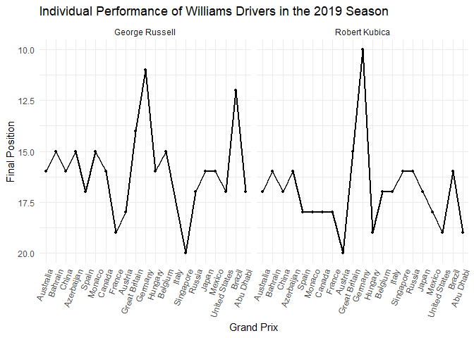
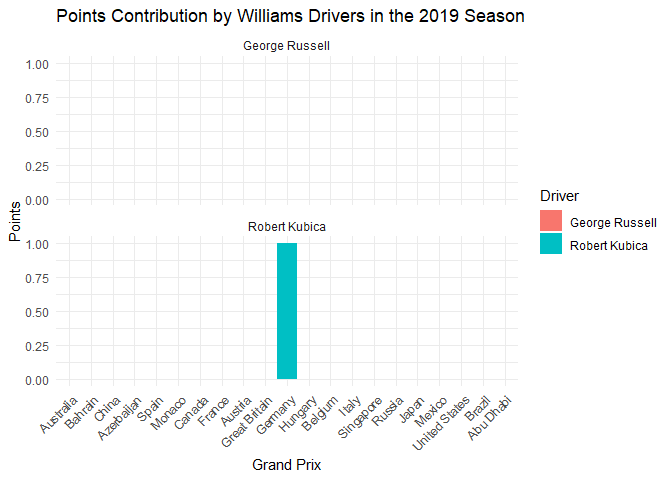
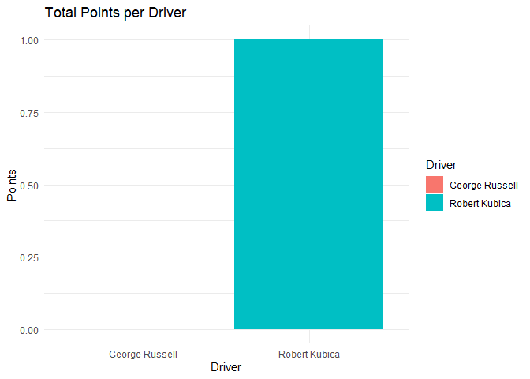
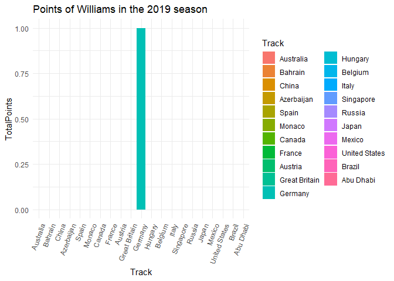
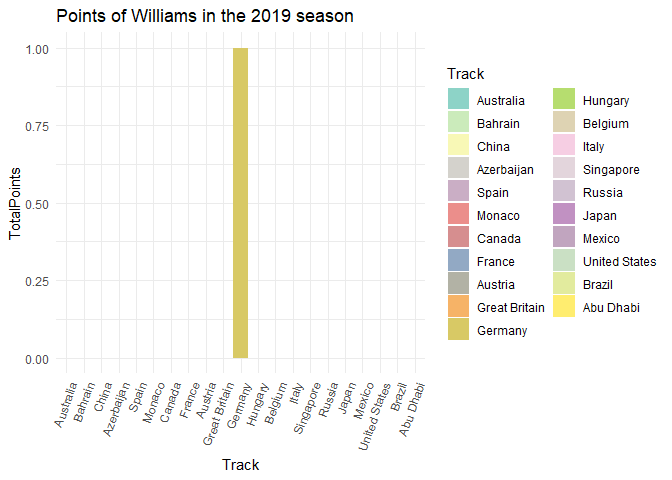
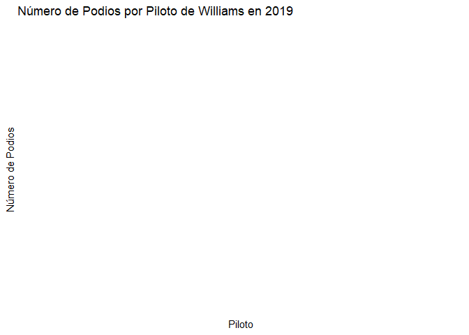

Williams 2019
================
Moises Carrillo
2024-08-17

## Introduction

This report analyzes the performance of the Williams team in the 2019
Formula 1 season. We examine aspects such as final positions, points
earned, poles, victories, tracks and fastest laps, as well as the
pole-to-victory conversion rate.

# Data loading and preparation

In this part we load the data and we do some cleaning of the database

``` r
f1_2019_results <- read.csv('C:/Users/moise/Analysis_project/formula1_2019season_raceResults.csv')

williams_2019 <- f1_2019_results %>%
  filter(Team == "Williams Mercedes", ignore.case = TRUE) %>% 
  select(Driver, Position, Points, Track, Starting.Grid, Fastest.Lap)

str(williams_2019$Position)
```

    ##  chr [1:41] "16" "17" "15" "16" "16" "17" "15" "16" "17" "18" "15" "18" ...

``` r
williams_2019$Position <- as.numeric(williams_2019$Position)
```

    ## Warning: NAs introduced by coercion

``` r
williams_2019$Track <- factor(williams_2019$Track, levels = unique(f1_2019_results$Track))
williams_2019$Position[29] <- 20
williams_2019$Position[30] <- 16
williams_2019$Position[31] <- 17
williams_2019$Position[37] <- 19
williams_2019
```

    ##            Driver Position Points         Track Starting.Grid Fastest.Lap
    ## 1  George Russell       16      0     Australia            19          No
    ## 2   Robert Kubica       17      0     Australia            20          No
    ## 3  George Russell       15      0       Bahrain            19          No
    ## 4   Robert Kubica       16      0       Bahrain            20          No
    ## 5  George Russell       16      0         China            17          No
    ## 6   Robert Kubica       17      0         China            18          No
    ## 7  George Russell       15      0    Azerbaijan            16          No
    ## 8   Robert Kubica       16      0    Azerbaijan            18          No
    ## 9  George Russell       17      0         Spain            19          No
    ## 10  Robert Kubica       18      0         Spain            17          No
    ## 11 George Russell       15      0        Monaco            19          No
    ## 12  Robert Kubica       18      0        Monaco            20          No
    ## 13 George Russell       16      0        Canada            18          No
    ## 14  Robert Kubica       18      0        Canada            19          No
    ## 15  Robert Kubica       18      0        France            18          No
    ## 16 George Russell       19      0        France            20          No
    ## 17 George Russell       18      0       Austria            20          No
    ## 18  Robert Kubica       20      0       Austria            17          No
    ## 19 George Russell       14      0 Great Britain            19          No
    ## 20  Robert Kubica       15      0 Great Britain            20          No
    ## 21  Robert Kubica       10      1       Germany            18          No
    ## 22 George Russell       11      0       Germany            17          No
    ## 23 George Russell       16      0       Hungary            15          No
    ## 24  Robert Kubica       19      0       Hungary            19          No
    ## 25 George Russell       15      0       Belgium            14          No
    ## 26  Robert Kubica       17      0       Belgium            20          No
    ## 27  Robert Kubica       17      0         Italy            15          No
    ## 28  Robert Kubica       16      0     Singapore            19          No
    ## 29 George Russell       20      0     Singapore            18          No
    ## 30  Robert Kubica       16      0        Russia            18          No
    ## 31 George Russell       17      0        Russia            17          No
    ## 32 George Russell       16      0         Japan            18          No
    ## 33  Robert Kubica       17      0         Japan            20          No
    ## 34 George Russell       16      0        Mexico            19          No
    ## 35  Robert Kubica       18      0        Mexico            20          No
    ## 36 George Russell       17      0 United States            18          No
    ## 37  Robert Kubica       19      0 United States            19          No
    ## 38 George Russell       12      0        Brazil            18          No
    ## 39  Robert Kubica       16      0        Brazil            19          No
    ## 40 George Russell       17      0     Abu Dhabi            18          No
    ## 41  Robert Kubica       19      0     Abu Dhabi            19          No

### Individual driver performance

We analyzed the individual performance of each driver trough the entire
season by visualize their finish position in each race of the 2019
season.

``` r
ggplot(williams_2019, aes(x = Track, y = Position, group = Driver)) +
  geom_line(linewidth = 1) +
  geom_point(size = 1) +
  scale_y_reverse() +
  labs(title = "Individual Performance of Williams Drivers in the 2019 Season",
       x = "Grand Prix",
       y = "Final Position") +
  theme_minimal() +
  theme(axis.text.x = element_text(angle = 70, hjust = 1)) +
  facet_wrap(~ Driver)
```

<!-- -->

We see that bout Williams drivers suffered trough all the season,
because they only could get one time into the top 10.

### Points contribution

We analyzed the contribution in points of each driver

``` r
ggplot(williams_2019, aes(x = Track, y = Points, fill = Driver)) +
  geom_bar(stat = "identity") +
  labs(title = "Points Contribution by Williams Drivers in the 2019 Season",
       x = "Grand Prix",
       y = "Points") +
  theme_minimal() +
  theme(axis.text.x = element_text(angle = 45, hjust = 1)) +
  facet_wrap(~ Driver, ncol = 1)
```

<!-- -->

With all that happen in the Germany GP, Kubica took the chance and
scored the only point that the team could scored trough all season.

## Total points analysis

### Total points by driver

We analyzed the total points that each driver did in the 2019 season

``` r
total_points <- williams_2019 %>% 
  group_by(Driver) %>% 
  summarise(Totalpoints = sum(Points, na.rm = TRUE)) 

total_points
```

    ## # A tibble: 2 × 2
    ##   Driver         Totalpoints
    ##   <chr>                <int>
    ## 1 George Russell           0
    ## 2 Robert Kubica            1

``` r
ggplot(total_points, aes(x = Driver, y = Totalpoints, fill = Driver)) +
  geom_bar(stat = 'identity') +
  labs(title = "Total Points per Driver", 
       x = "Driver",
       y = "Points") +
  theme_minimal()
```

<!-- -->

### Points of the team

Points of the team

``` r
williams_points <- williams_2019 %>%
  group_by(Track) %>%
  summarise(TotalPoints = sum(Points, na.rm = TRUE)) %>%
  ungroup()

williams_points
```

    ## # A tibble: 21 × 2
    ##    Track         TotalPoints
    ##    <fct>               <int>
    ##  1 Australia               0
    ##  2 Bahrain                 0
    ##  3 China                   0
    ##  4 Azerbaijan              0
    ##  5 Spain                   0
    ##  6 Monaco                  0
    ##  7 Canada                  0
    ##  8 France                  0
    ##  9 Austria                 0
    ## 10 Great Britain           0
    ## # ℹ 11 more rows

### Track points

We analyzed which was the circuits were the team score more points

``` r
top_circuits <- williams_points %>%
  top_n(3, wt = TotalPoints) %>%
  arrange(desc(TotalPoints))

top_circuits
```

    ## # A tibble: 21 × 2
    ##    Track      TotalPoints
    ##    <fct>            <int>
    ##  1 Germany              1
    ##  2 Australia            0
    ##  3 Bahrain              0
    ##  4 China                0
    ##  5 Azerbaijan           0
    ##  6 Spain                0
    ##  7 Monaco               0
    ##  8 Canada               0
    ##  9 France               0
    ## 10 Austria              0
    ## # ℹ 11 more rows

``` r
ggplot(top_circuits, aes(x = Track, y = TotalPoints, fill = Track))+
  geom_bar(stat = "identity")+
  labs(title = "Points of Williams in the 2019 season")+
  theme_minimal() +
  theme(axis.text.x = element_text(angle = 70, hjust = 1))
```

<!-- -->

Germany was the only circuit where they could get a point.

### Total pints per track

We analyzed how many points scored Williams per each circuit

``` r
ggplot(williams_points, aes(x = Track, y = TotalPoints, fill = Track))+
  geom_bar(stat = "identity")+
  labs(title = "Points of Williams in the 2019 season")+
  theme_minimal() +
  theme(axis.text.x = element_text(angle = 70, hjust = 1))+
  scale_fill_manual(values = colorRampPalette(brewer.pal(12, "Set3"))(21))
```

<!-- -->

### Total points of the season for the team

``` r
total_points_season <- williams_2019 %>% 
  summarise(TotalPoints = sum(Points, na.rm = TRUE))

total_points_season
```

    ##   TotalPoints
    ## 1           1

At the end of the season, Williams scored 1 points and that give them
the tenth place in the Constructors championship of the 2019 season of
Formula 1

## Analysis of poles and victories

### Number of poles per driver

We analyzed the number of poles that each driver did.

``` r
n_poles <- williams_2019 %>% 
  filter(Starting.Grid == 1) %>%
  count(Driver, name = "NumPoles")

n_poles
```

    ## [1] Driver   NumPoles
    ## <0 rows> (or 0-length row.names)

None drivers made Poles

### Track poles

We analyzed in which circuits the drivers made pole position

``` r
williams_2019$Track <- as.character(williams_2019$Track)#Convert track into a vector

track_poles <- williams_2019 %>% 
  filter(Starting.Grid == 1) %>% 
  select(Driver, Track)

track_poles
```

    ## [1] Driver Track 
    ## <0 rows> (or 0-length row.names)

### Number of victories per driver

We analyzed the number of victories that each driver did, and we
compared.

``` r
n_victories <- williams_2019 %>% 
  filter(Position == 1) %>%
  count(Driver, name = "NumVictories")

n_victories
```

    ## [1] Driver       NumVictories
    ## <0 rows> (or 0-length row.names)

None drivers got victories

### Track victories

We analyzed in which circuits the drivers got a victories

``` r
n_victories <- williams_2019 %>% 
  filter(Position == 1)%>%
  count(Driver, name = "NumVictories")

n_victories
```

    ## [1] Driver       NumVictories
    ## <0 rows> (or 0-length row.names)

### Pole to victory conversion rate

As each driver made pole and victory, we analyzed what was the
conversion rate that each driver made to convert a pole to victory

``` r
poles_victories <- williams_2019 %>%
  group_by(Driver) %>% 
  filter(Starting.Grid == 1) %>%
  summarise(TotalPoles = n(),
            PolesConvertedToWins = sum(Position == 1)) %>%
  mutate(ConversionRate = (PolesConvertedToWins / TotalPoles) * 100)

poles_victories
```

    ## # A tibble: 0 × 4
    ## # ℹ 4 variables: Driver <chr>, TotalPoles <int>, PolesConvertedToWins <int>,
    ## #   ConversionRate <dbl>

As there are no poles and victories, there is no conversion.

### Poles and victory

This is for in which circuit the driver made pole and get the victory of
the same race

``` r
poles_and_victorie <- williams_2019 %>% 
  filter(Starting.Grid == 1, Position == 1) %>% 
  select(Driver, Track)

poles_and_victorie
```

    ## [1] Driver Track 
    ## <0 rows> (or 0-length row.names)

## Analyze podiums and fastest laps

\#Podiums

We analyzed how many podiums got each driver

``` r
podiums_per_driver <- williams_2019 %>%
  group_by(Driver) %>% 
  filter(Position %in% 1:3) %>%
  count(Driver, name = "NumPodiums")

podiums_per_driver
```

    ## # A tibble: 0 × 2
    ## # Groups:   Driver [0]
    ## # ℹ 2 variables: Driver <chr>, NumPodiums <int>

``` r
#Graphs of podiums
ggplot(podiums_per_driver, aes(x = Driver, y = NumPodiums, fill = Driver)) +
  geom_bar(stat = "identity") +
  labs(title = "Número de Podios por Piloto de Williams en 2019",
       x = "Piloto",
       y = "Número de Podios") +
  theme_minimal()
```

<!-- -->

``` r
facet_wrap(~Driver)
```

    ## <ggproto object: Class FacetWrap, Facet, gg>
    ##     compute_layout: function
    ##     draw_back: function
    ##     draw_front: function
    ##     draw_labels: function
    ##     draw_panels: function
    ##     finish_data: function
    ##     init_scales: function
    ##     map_data: function
    ##     params: list
    ##     setup_data: function
    ##     setup_params: function
    ##     shrink: TRUE
    ##     train_scales: function
    ##     vars: function
    ##     super:  <ggproto object: Class FacetWrap, Facet, gg>

### Fastests laps

We analyzed how many fastest laps got each driver.

``` r
fastest_laps_per_driver <- williams_2019 %>%
  group_by(Driver) %>% 
  filter(Fastest.Lap == "Yes") %>%
  count(Driver, name = "NumFastestLaps")

fastest_laps_per_driver
```

    ## # A tibble: 0 × 2
    ## # Groups:   Driver [0]
    ## # ℹ 2 variables: Driver <chr>, NumFastestLaps <int>

No fastest laps

# Conclusion

This analysis showcases that bout drivers suffered trough all season,
they did not get a good car, and that see into the points, they only
could get a point, and it was in Germany.
